# SSH key 등록 & EC2 시작하기

가입 후 콘솔을 접속하면 먼저 리전(지역)을 선택해야한다.

모든 서비스를 눌러보면 엄청 많은 아마존의 서비스들을 볼 수 있다.

## EC2 시작하기

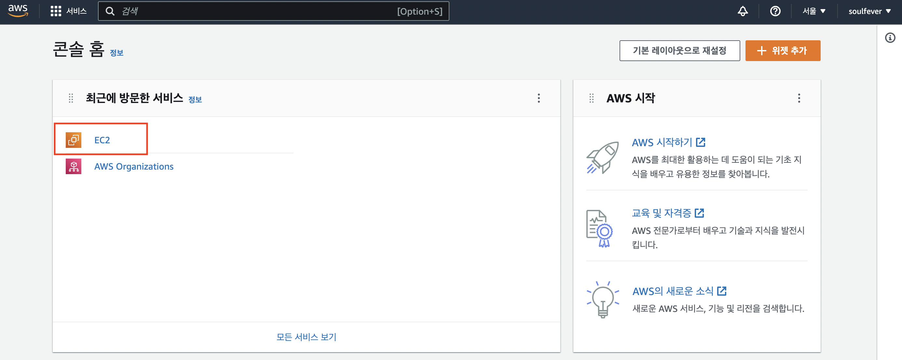

- ec2 대시보드에 접속

- 네트워크 키페어 접속 → 키페어 생성 클릭

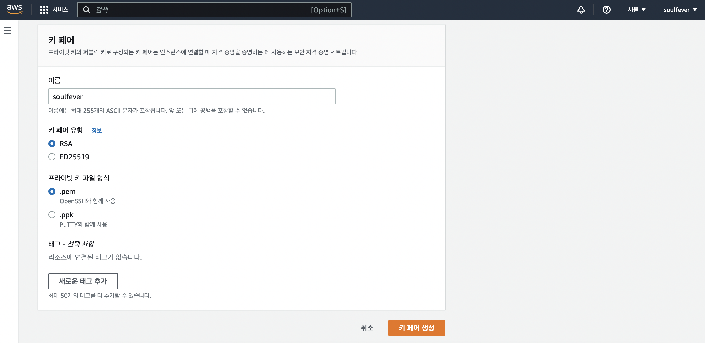

- 이름, 유형 등을 설정하고 키페어를 생성

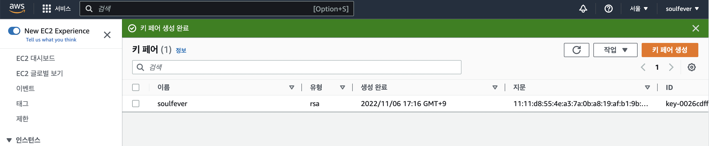

- 키페어가 생겼다

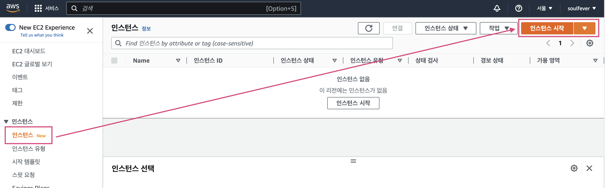

- 인스턴스를 시작

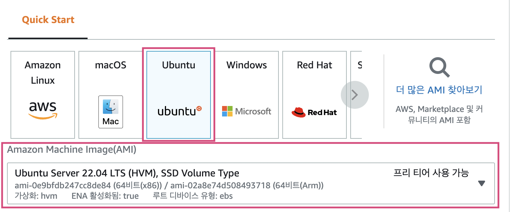

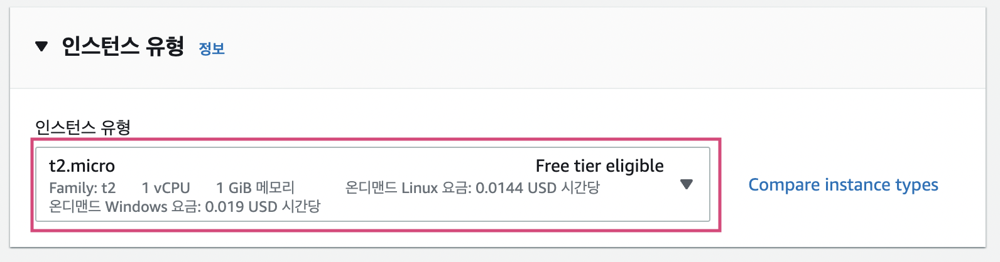

- 이번 예제에서는 우분투 22.04 LTS 버전에서 프리티어인 t2-micro를 사용할 예정

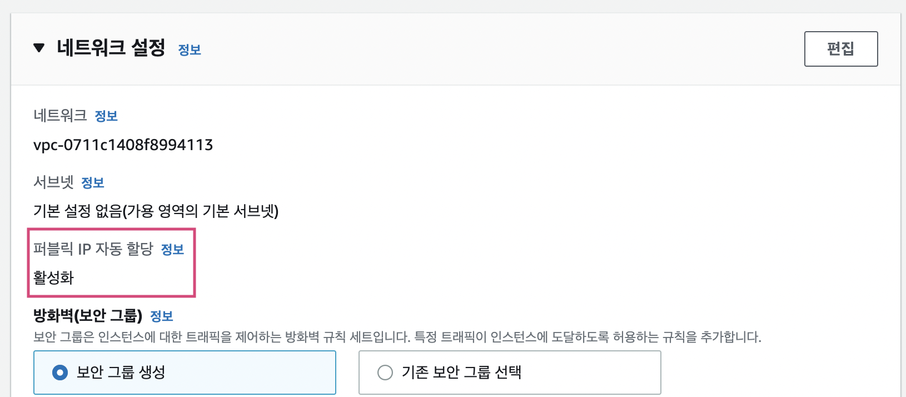

- 퍼블릭 IP 자동 할당이 ‘활성화’되있는 지 확인

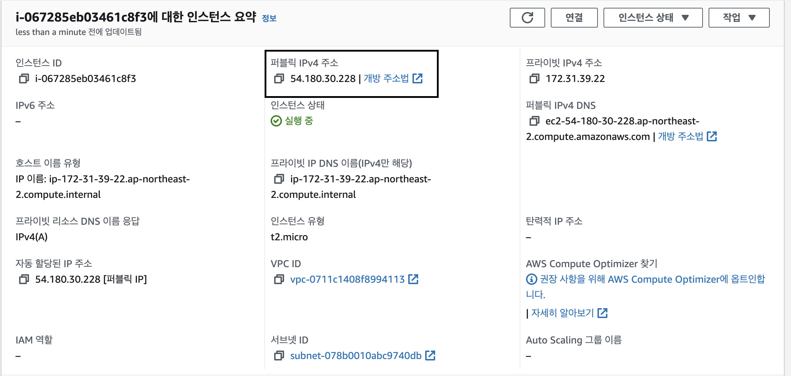

- EC2 인스턴스에 들어가서 퍼블릭 IP 주소를 복사한다.

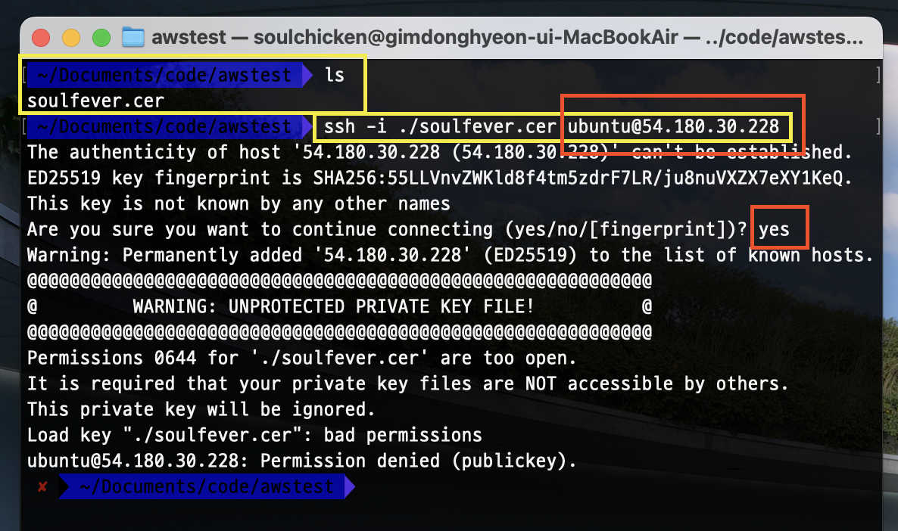

- 터미널에서 키페어와 우분투 퍼블릭IP를 입력해서 접속하려고 하니 **접속이 안됨**

→ SSH 키는 최소권한이어야만 사용할 수 있다.

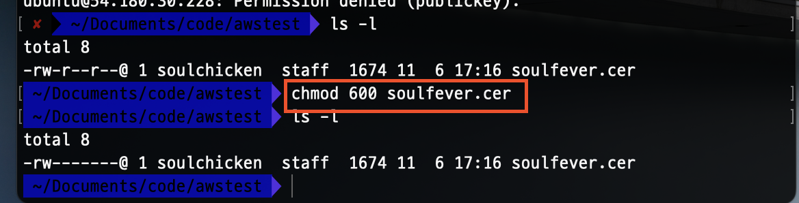

- chmod로 권한설정을 해준다.
- 읽기, 쓰기 권한만 가능하도록 수정

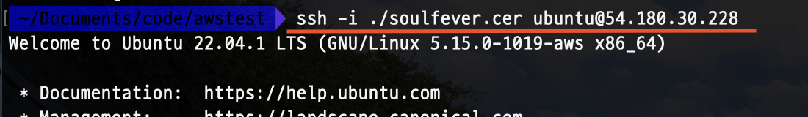

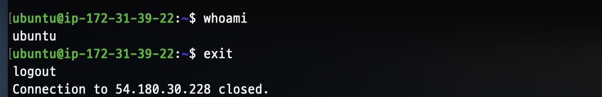

- 이제 우분투 접근이 잘 된다.
- exit으로 로그아웃

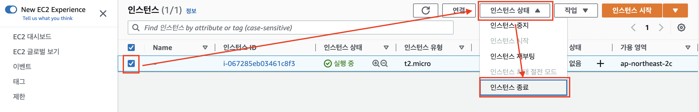

- EC2 종료
