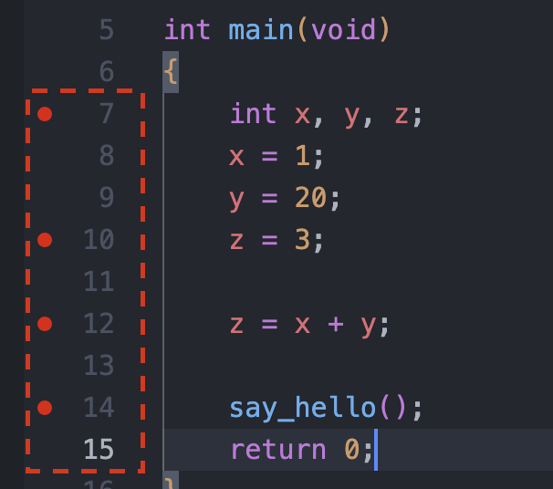

# C언어 INTRO

## **C의 해부학**

- 메모리(주기억장치)로부터 데이터를 입력받고 그 데이터를 활용해서 기능을 수행하고 그 결과 데이터를 메모리에게 돌려준다.
- C언어를 이루는 기본적인 구성요소는 **함수**이다.  
  : **입력(Input) → 함수(Function) → 출력(Output)**
- 복잡해보이는 프로그램도 결국 여러 함수들이 모여서 생긴 큰 함수를 통해 입력을 출력으로 만드는 것 뿐이다.

## **C 프로그램 훑어보기**

**예시 코드**

```c
#include <stdio.h> // 전처리기

int main(void) // main 함수 정의 시작
{              // 영역 scope의 시작
    int a; // 변수 선언 vaiable declaration
    int b;
    int c;

    a = 1; // 변수에 값 대입 assignment
    b = 2;
    c = a + b; // 변수에 연산 operation 결과 대입

    printf("Result is %i", c); // 함수 호출 call or invoke

    return 0; // 결과 값 value을 반환 return
}            // 영역 scope의 끝
```

**전처리기 Preprocessor instruction** ← `#inclue <stdio.h>`

- 컴파일 하기 전에 처리하는 코드

## 변수가 편리한 이유

- 1 + 2 = ?
- 어떤 숫자 + 어떤 숫자 = ?
- n + m = ?

### 값과 변수

**값 value** : `1 + 2 = 3`

**변수 variable** : `x + y = z`

→ 값으로만 나오면 그때그때 사용하고 끝이지만 변수를 사용한다면 재사용성이 늘어난다. 값의 일반적이고 확장된 개념으로 변수를 사용한다.

- CPU(계산) + RAM(계산에 필요한, 계산의 결과 데이터 저장)
  - CPU는 RAM에 x,y의 주소를 알려달라고 요청한다. 그 결과를 RAM에 저장하게 된다.
- C언어에서는 변수의 개념으로 주소를 거치는 과정을 생략하게 한다.
  - 1, 2, 3같은 수들은 이미 주소에 할당 되어있기 때문에 사용하기만 하면 된다.

## 자료형이 필요한 이유

- 변수를 실제로 사용하기 위해서 필요함
- **자료형**의 예 : `int`

### 자료형의 필요성

- 정수(integers), 실수(real numbers)를 **CPU**가 구분할 수 없기 때문이다.  
  ⇒ 미리 정수인지 실수인지 인지시켜준다면 **CPU**의 판단 기준이 된다.

### 자료형마다 차지하는 메모리 사이즈가 다르다

`int` : 4바이트, -2,147,483,648 ~ 2,147,483,647

`short` : 2바이트, -32,768 ~ 32,767

`char` : 1바이트, -128 ~ 127

## 변수를 선언하는 방법

### int형의 변수 선언하기

```c
int main() // main(void)도 된다.
{
    // int형의 변수 x를 선언해보기!
    int x; // declaration
    int y;
    int z;

    x = 1; // 할당한다. assignment
    y = 2;
    z = x + y;
    return 0;
}
```

### 변수를 한 번에 여러 개 만들기

```c
int a, b, c;
```

### 선언과 할당을 같이 하기

```c
int q = 1, w = 2, e;
```

### 변수명에 들어갈 수 있는 문자

```c
int num_apples; // 변수명에 언더스코어(_)를 사용할 수 있다.
int _hot; // 변수명 맨 앞에 언더스코어를 넣을 수 있다.
int Num;
int NUM_A;
int my_love;
int house;
int cracker;
// int 2hi; 숫자는 변수명 앞에 들어갈 수 없다.
// int tax rate; 변수명엔 빈칸을 넣을 수 없다.
// int hot-tube; 변수명에 '-' 를 넣을 수 없다. (다른 특수기호들도 사용할 수 없다.)
// int int; 변수명에 예약어를 사용할 수 없다.
```

## printf() 함수의 기본적인 사용법

- **입력** → **printf( …입력… )** → **출력**

```c
#include <stdio.h>

int main(void)
{
    printf("나는 사실 아이언맨임 ㄷㄷ")
    // 이 대사는 중간에 대사를 멈칫하면서 해야 멋있다. 줄바꿈을 해보자.
    printf("The truth is ...\n\n\n\nI am Ironman.");
    return 0;
}
```

- **escape sequence** : `\n` 줄바꿈같은 문자열
  - `\`가 나오면 문자열을 읽다가 멈추고 그것에 맞는 ‘무언가 행위’를 한다.
  - `printf(’\a’)`를 하면 알림음이 나온다.

### 따옴표 출력하기

```c
#include <stdio.h>

int main(void)
{
    printf("The truth is ... I am \"Ironman\".");
    return 0;
}
```

- **escape sequence**로 `\”` 을 사용하면 따옴표를 문자열에 넣을 수 있다.

### printf는 끝나도 줄바꿈을 하지 않는다

```c
#include <stdio.h>

int main(void)
{
    printf("The truth is ...")
		pritf("I am \"Ironman\".");
    return 0;
}
```

- 우리는 2줄로 출력을 원하지만 위 코드를 실행하면 한 줄로 실행된다. 줄바꿈을 안했기 때문이다.

### print ‘f’ 인 이유

- print format의 줄임말

```c
#include <stdio.h>

int main(void)
{
    int x = 1;
    int y = 2;
    int z = x + y;
    printf("%i + %i = %i\n", x, y, z);
    printf("The answer is %d", z);
    return 0;
}
// 1 + 2 = 3
// The answer is 3
// 위 2줄이 출력된다.
```

- 숫자를 넣고 싶은 부분에 %를 사용해서 포맷팅을 한다.
- `%d` : 10진수
- `%i` : integer
  - d, i의 차이는 `scanf`에서만 조금 차이가 난다.

## 주석 (comment)

- 블럭 주석과 한 줄 주석

```
/*
여러 줄 주석 1
여러 줄 주석 2
여러 줄 주석 3
*/

// 한 줄 주석
```

- 주석은 달아야 할 곳에 꼭 달고, 필요하지 않다면 굳이 달지 않는다.

### 단축키

- 한 줄 : Ctrl + /
- 블럭 : Alt + Shift + A

## 키워드와 예약어

- C keyowds : [https://en.cppreference.com/w/c/keyword](https://en.cppreference.com/w/c/keyword)
- 키워드는 변수명, 함수명으로 사용하지 않는다!
- `printf`는 `stdio.h`를 `include`하지 않으면 사용할 수 있다. 그러나 이러느니 변수명으로 안쓰는게 낫다.

```c
// #include <stdio.h>

int main(void)
{
    int printf = 1;
    return 0;
}
```

```c
#include <stdio.h>

int main(void)
{
    int printf = 1;
    printf("hi!"); // 여기에서 에러 발생
    return 0;
}
```

## 함수 만들기

- `main`, `printf`말고 우리가 함수를 만들어보기

```c
#include <stdio.h>

void say_hello(void) // 리턴할 값 : 보이드, 입력값 : 보이드
{
    printf("Hello!\n");
    return;
}

int main(void)
{
    say_hello();
    return 0;
}
```

- 함수는 변수처럼 미리 선언이 되어있지 않으면 사용할 수 없다.
  - 만약 `main` 함수가 `say_hello`보다 먼저 있다면 에러가 나온다.
- 무조건 위에 나와야하니 불편하다. 그래서 미리 **‘선언’**만 하는 것이 가능하다.

```c
#include <stdio.h>

void say_hello(void); // 미리 프로토타입으로 선언
// prototyping, function declaration

int main(void)
{
    say_hello();
    return 0;
}

void say_hello(void) // function definition
{
    printf("Hello!\n");
    return;
}
```

## 디버거 사용법

- 프로그래머는 코드 작성보다 오류를 잡는 디버깅을 더 많이 하게 된다…

1. **브레이크 포인트를 찍어준다.**

   

2. **디버깅을 누르면 브레이크포인트에서 멈춘다.**

   순차적으로 변수의 값이 바뀌는 것을 확인할 수 있다

   {: width="300”}

   {: width="300”}

   {: width="300”}

   {: width="300”}

## 문법 오류와 문맥 오류

### 문법 오류 (Syntax Error)

- 보통 개발환경(에디터 등)에서 알려줌
- 컴파일 해줄 수 없다고 알려줌
- 프로그래머가 크게 고민할 거리는 아니다

```c
int main(void)
{
    int n1, n2, n3, n4;
    n5 = 3; // 이미 에디터에서 빨간줄 긋고 알려줌

    return 0;
}
```

### 문맥 오류 (Semantic Error)

```c
int main(void)
{
    int n1, n2, n3, n4;

    n1 = 2;
    n2 = n1 * n1;
    n3 = n2 * n1;
    n4 = n2 * n1; // 원래 n3 * n1 을 했어야했는데...

    return 0;
}
```

- 원래 의도와 다르게 실수로 다른 코드를 적어버리면 컴파일이 성공하기 때문에 잡아내기 어렵다
- 프로그래머의 가장 큰 고민거리가 되는 부분…

## 읽기 좋은 코드를 만드는 요령

- 현대 소프트웨어는 협업을 통해 만들어지기 때문에 읽기 좋은 코드를 만들어야한다.
- 코딩 스타일, 코딩 컨벤션을 맞춰야한다.
- 정답은 없고 합의를 봐야하고 적응해야한다.
- 필요한 부분에 꼭 빈 줄이나 인덴트를 넣어야한다.
