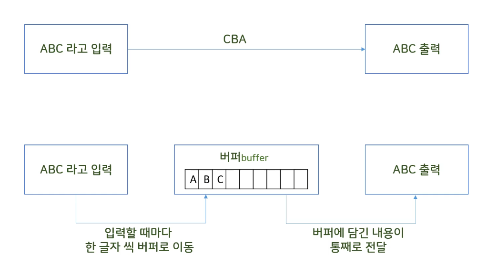

# 문자 입출력과 입력 유효성 검증

## 입출력 버퍼

{: width="300”}

- 버퍼 : 입,출력시 한꺼번에 모아서 사용하면 효율이 높기 때문에 사용한다.
- 버퍼는 효율성을 높힐 수 있는 구조로 사이즈를 만든다.
- 버퍼에 모아둔 데이터를 한 번에 처리하는 시점
  - 버퍼가 꽉찼을 때
  - escape sequence(엔터, ‘\n’)같은 데이터가 들어왔을 때

### 버퍼를 사용하는 경우

```c
#define _CRT_SECURE_NO_WARNINGS
#include <stdio.h>
#include <conio.h> // windows, _getch(), _getche()

int main()
{
	char c;
	while ((c = getchar() != '.')) {
		putchar(c);
	}
	return 0;
}
<< Hello. 입력!
>> Hello 출력!
```

### 버퍼를 사용하지 않는 경우

- **get char echo**

```c
#define _CRT_SECURE_NO_WARNINGS
#include <stdio.h>
#include <conio.h> // windows, _getch(), _getche()

int main()
{
	char c;
	while ((c = _getche() != '.')) {
		putchar(c);
	}
	return 0;
}
>> (a 입력!) aa
>> (b 입력!) aabb
```

- **getch**

```c
#define _CRT_SECURE_NO_WARNINGS
#include <stdio.h>
#include <conio.h> // windows, _getch(), _getche()

int main()
{
	char c;
	while ((c = _getch() != '.')) {
		putchar(c);
	}
	return 0;
}
>> hello. 입력!
>> (hello.은 사라짐) hello
```
