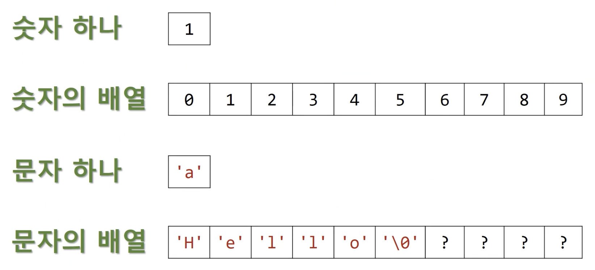

# 반복문

## while 반복 루프에서 scanf()의 반환값 사용하기

```c
#define _CRT_SECURE_NO_WARNINGS
#include <stdio.h>

int main()
{
    int num, sum = 0;
    int status;
    printf("Enter next integer (q to quit) : ");
    status = scanf("%d",&num);
    while (status)
    {
        sum += num;
        printf("Enter next integer (q to quit) : ");
        status = scanf("%d",&num);
    }
    printf("Sum = %d\n", sum);
    return 0;
}
```

- scanf의 return 값 : 입력 성공한 인자의 갯수
- 만약 코드를 줄인다면?

```c
#define _CRT_SECURE_NO_WARNINGS
#include <stdio.h>

int main()
{
    int num, sum = 0;
    printf("Enter next integer (q to quit) : ");
    while (scanf("%d",&num))
    {
        sum += num;
        printf("Enter next integer (q to quit) : ");
    }
    printf("Sum = %d\n", sum);
    return 0;
}
```

## 의사 코드

**Psuedocode**

- 사람의 언어로 코드를 작성하는 것. 문법보다는 논리 자체에 집중한다.
  - 언어와 분리되어 있기 때문에 누구든 논리를 이해할 수 있다.
- 예시로 사용했던 코드 옆에 의사코드를 적어본다면 이러하다.

```c
#define _CRT_SECURE_NO_WARNINGS
#include <stdio.h>

int main()
{
    int num, sum = 0; // sum을 0으로 초기화한다.
    printf("Enter next integer (q to quit) : "); // 사용자에게 안내한다.
    while (scanf("%d",&num)) // 입력을 받고, 입력이 정수인동안에는 입력을 sum에 더한다.
    {
        sum += num;
        printf("Enter next integer (q to quit) : "); // 사용자에게 안내한다.
    }
    printf("Sum = %d\n", sum); // sum을 출력한다.
    return 0;
}
```

## 진입조건 루프 while

**Entry-Condition Loop**

```bash
while (expression)
        statement
```

- `expression`이 `true`일 때 `statement` 실행

### 무한 루프

```c
int i;
i = 1;
while (i < 5) // infinite loop
    printf("Hi!\n");
```

### 잘못된 루프 - 탈출조건

```c
int i;
i = 1;
while (--i < 5) // wrong direction
    printf("Hi!\n");
```

### 잘못된 루프 2 - 중괄호를 사용하자

```c
int i;
i = 1;
while (i < 5) // wrong direction
    printf("Hi!\n");
    i++; // while문 바깥에 있다
```

### 진입할 수 없는 루프

```c
int i;
i = 10;
while (i++ < 5) // cannot enter
    printf("Hi!\n");
```

### null statement

```c
int i;
i = 0;
while (i++ < 5); // null statement
    printf("%i\n", i);
```

## 관계 연산자

**Reational Operators**

```c
<, <=, ==, >=, > !=
```

## 참과 거짓

참 : 1 (0이 아님)

거짓 : 0

```c
#include <stdio.h>

int main()
{
    int tv, fv;
    tv = (1 < 2);
    fv = (1 > 2);

    printf("True is %d\n", tv);
    printf("False is %d\n", fv);
    return 0;
}

>> True is 1
>> False is 0
```

### 0이 아니면 양수는 True

```c
#include <stdio.h>

int main()
{
    int i = 5;
    while (i)
        printf("%d is true\n", i--);
    printf("%d is false\n",i);
    return 0;
}

>> 5 is true
>> 4 is true
>> 3 is true
>> 2 is true
>> 1 is true
>> 0 is false
```

### 0이 아니면 음수라도 True

```c
#include <stdio.h>

int main()
{
    int i = -5;
    while (i)
        printf("%d is true\n", i++);
    printf("%d is false\n",i);
    return 0;
}

>> -5 is true
>> -4 is true
>> -3 is true
>> -2 is true
>> -1 is true
>> 0 is false
```

## \_Bool 자료형

- 전통적인 C언어에서는 정수 0, 1으로 참 거짓을 판별했다.
- 기존의 판별 방법과 호환하기 위해서 남겨놓고 언더스코어(`_`)가 붙은 자료형으로 생겨났다.

```c
#define _CRT_SECURE_NO_WARNINGS
#include <stdio.h>
#include <stdbool.h>

int main()
{
    _Bool boolean_true = (2 > 1);
    _Bool boolean_false = (2 < 1);
    printf("True is %d\n", boolean_true);
    printf("False is %d\n", boolean_false);

    // 삼항 연산자 or 조건 연산자 사용하기
    printf(boolean_true ? "true" : "false");
    printf("\n");
    printf(boolean_false ? "true" : "false");
    return 0;
}

>> True is 1
>> False is 0
>> true
>> false
```

## 관계 연산자의 우선순위

[Operators Precedence in C](https://www.tutorialspoint.com/cprogramming/c_operators_precedence.htm)

| Category       | Operator                         | Associativity |
| -------------- | -------------------------------- | ------------- | ------------- | ------------- |
| Postfix        | () [] -> . ++ - -                | Left to right |
| Unary          | + - ! ~ ++ - - (type)\* & sizeof | Right to left |
| Multiplicative | \* / %                           | Left to right |
| Additive       | + -                              | Left to right |
| Shift          | << >>                            | Left to right |
| Relational     | < <= > >=                        | Left to right |
| Equality       | == !=                            | Left to right |
| Bitwise AND    | &                                | Left to right |
| Bitwise XOR    | ^                                | Left to right |
| Bitwise OR     |                                  |               | Left to right |
| Logical AND    | &&                               | Left to right |
| Logical OR     |                                  |               |               | Left to right |
| Conditional    | ?:                               | Right to left |
| Assignment     | = += -= \*= /= %=>>= <<= &= ^=   | =             | Right to left |
| Comma          | ,                                | Left to right |

- 의외로 `== !=`는 `< <= > >=` 보다 우선순위가 낮다.

## for 루프 소개

- counting loop (vs Indefinite loop `while`)
- 유연하고 의도를 분명하게 사용할 수 있는 반복문이라서 자주 사용

```c
#include <stdio.h>

int main()
{
    for (int i = 0; i < 10; i++)
    {
        printf("%d ", i);
    }
}
```

- `i++`이 일어난 이후에 `i < 10`을 판별한다.

## for 문의 유연성

- 유연하게 여러 방식으로 사용 가능한 for 문

```c
for (int i = 10; i > 0; i--)
{
    printf("%d ", i);
}

for (int i = 0; i < 100; i = i + 8)
{
    printf("%d ", i);
}

for (char c = 'A'; c <= 'Z'; c++)
{
    printf("%c ", c);
}

for (int i = 0; i * i < 10; i++)
{
    printf("%d ", i);
}

for (int x = 1, y = 5; y <= 20; y = (++x * 3) + 10)
{
    printf("%d ", x);
}

for (double d = 100.0; d < 300; d = d * 1.1)
{
    printf("%f\n", d);
}
```

### for문 내의 blank

```c
int i, n;
n = 2;
for (i = 2; n < 10;)
{
    n = n * i;

    /* 어쩌고 저쩌고 */
}

for (;;) /* while문과 같음 */
    printf("I love U!");
```

### 과하지만 for 문을 활용하는 방법

```c
int i = 0;
for (printf("Let's go!\n"); i != 7; scanf("%d", &i))
    ; // null statement
```

## 다양한 대입 연산자

- 우선순위는 콤마 연산자(`,`) 다음으로 **가장 낮다**.
  - assignment(`=`)는 가장 마지막에 하는 것이 맞기 때문

```c
+= *= *= /= %=
```

### 성능을 신경쓴다면?

- 사실 요즘 컴파일러가 좋아져서 성능차이가 없으니 가독성이 높으니 대입 연산자를 쓰는 것이 좋다. 그러나 엄밀히 따지면 대입 연산자보다는 일반 연산이 더 빠르다.
  - `i += 2` 보다 `i = i + 2` 가 더 빠르긴 하다.

## 콤마 연산자

- comma : `,`
- 연산자 우선 순위 중에서 가장 낮음

### 구분 (separators)

```c
for (int n = 0, nsqr = n * n; n < 10; n++, nsqr = n * n)
    printf("%d %d\n", n, nsqr);
```

### sequence point

```c
int i, j;
i = 1;
i++, j = i;
printf("%d %d\n", i, j);

int x, y, x;
z = x = 1, y = 2;
printf("%d %d %d\n", x, y, z); // 1, 2, 1
z = (x = 1), (y = 2);
printf("%d %d %d\n", x, y, z); // 1, 2, 1
z = ((x = 1), (y = 2));
printf("%d %d %d\n", x, y, z); // 1, 2, 2

int money = (123, 456);
printf("%d\n", money); // 456
```

## 탈출조건 루프 do while

**Exit-Condition Loop**

### while문을 활용해서 비밀번호 입력하는 프로그램 만들기

```c
#include <stdio.h>

int main()
{
    const int PASSWORD = 3333;
    int guess = 0;

    printf("Enter password : ");
    scanf("%d", &guess);

    while (guess != PASSWORD)
    {
        printf("Enter password : ");
        scanf("%d", &guess);
    }

    printf("Good!\n");
}
```

### do-while문으로 비밀번호 입력하는 프로그램 만들기

- 무조건 1번 입력을 받아야하는 이 프로그램 특성상 유용하다

```c
#include <stdio.h>

int main()
{
    const int PASSWORD = 3333;
    int guess = 0;

    do
    {
        printf("Enter password : ");
        scanf("%d", &guess);
    } while (guess != PASSWORD);

    printf("Good!\n");
}
```

## 어떤 루프를 사용할까?

### 진입 조건 (while, for) vs 탈출 조건 (do while)

- do while이 덜 쓰이더라도 유연하게 사용하기 위해서 종종 활용해보자
- 어떤 반복문을 사용하든 효율적이고 읽기 좋으면 된다

### for vs while

- 대부분 for를 더 많이 쓰게 되어 있긴 하다. 메모리 구조에 맞춰서 원하는 갯수가 정해진 상황에서는 for문이 더 좋다.
- while문은 갯수가 정해져 있지 않은 상황에서 사용한다.

## 중첩된 루프

**Nested Loops**

- 2중 반복문으로 출력문을 만들어보기

```c
#include <stdio.h>

#define NUM_ROWS 5
#define FIRST_CHAR 'A'
#define LAST_CHAR 'K'

int main()
{
    for (int r = 0; r < NUM_ROWS; r++)
    {
        for (int c = FIRST_CHAR; c <= LAST_CHAR; c++)
        {
            printf("%c ", c);
        }
        printf("\n");
    }
}
>> A B C D E F G H I J K
>> A B C D E F G H I J K
>> A B C D E F G H I J K
>> A B C D E F G H I J K
>> A B C D E F G H I J K
```

- 계단식 출력

```c
#include <stdio.h>

#define NUM_ROWS 5
#define FIRST_CHAR 'A'
#define LAST_CHAR 'K'

int main()
{
    for (int r = 0; r < NUM_ROWS; r++)
    {
        for (int c = FIRST_CHAR; c <= FIRST_CHAR + r; c++)
        {
            printf("%c ", c);
        }
        printf("\n");
    }
}
>> A
>> A B
>> A B C
>> A B C D
>> A B C D E
```

## 배열과 런타임 에러

{: width="300”}

## 배열 Array

- 데이터의 묶음

```c
#define NUM_DAYS 365

int main()
{
    int daily_temperature[NUM_DAYS];
    double stock_prices_history[NUM_DAYS];

    printf("%zd\n", sizeof(stock_prices_history));
    printf("%zd\n", sizeof(double) * NUM_DAYS);
    printf("%zd\n", sizeof(stock_prices_history[0]));
}

>> 2920
>> 2920
>> 8
```

### 배열에 입력하기

```c
int main()
{

    int my_numbers[5];

    my_numbers[0] = 1; // 첫 메모리 주소에서부터 0칸이 떨어진 곳
    my_numbers[1] = 2;
    my_numbers[2] = 4;
    my_numbers[3] = 8;
    my_numbers[4] = 16;
    printf("%d\n", my_numbers[0]); // 1 출력
    scanf("%d", &my_numbers[0]); // 3 입력
    printf("%d\n", my_numbers[0]); // 3 출력
    scanf("%d", my_numbers); // 5 입력
    printf("%d\n", my_numbers[0]); // 5 출력
}
```

- `scanf("%d", &my_numbers[0]);` : my_numbers라는 배열의 0번 인덱스에 있는 값의 **주소(&)**를 scanf에 사용한다!
- `scanf("%d", my_numbers);` : `&` 기호 없이 바로 배열을 넣으면 첫 주소를 가리킨다.

### 런타임 에러

```c
int main()
{
    int my_numbers[5];

    my_numbers[0] = 1; // 첫 메모리 주소에서부터 0칸이 떨어진 곳
    my_numbers[1] = 2;
    my_numbers[2] = 4;
    my_numbers[3] = 8;
    my_numbers[4] = 16;

    /* Runtime error */
    my_numbers[5] = 123; // out of bound
    printf("%d\n", my_numbers[5]); // out of bound

    my_numbers = 7; // Compile error
}
```

- 컴파일에러와 다르게 런타임에러의 경우 코드가 돌아가기는 하나 그 코드가 실행되는 시점에서 문제를 야기할 수 있다.

## for 루프를 배열과 함께 사용하기

- 배열이 없다면 데이터를 관리할 때 종종 불편하다.

```c
/* Motivation */
int i1 = 0;
int i2 = 1;
int i3 = 2;
// ...

printf("%d\n", i1);
printf("%d\n", i2);
printf("%d\n", i3);
// ...
```

- 5개의 요소를 관리한다면 크기가 5인 배열을 선언하자
  - 인덱스를 통해 접근하기

```c
#include <stdio.h>

#define SIZE 5

int main()
{

    int my_arr[SIZE];

    // prepare for array data
    for (int i = 0; i < SIZE; i++)
    {
        my_arr[i] = i;
    }

    // print array data
    for (int i = 0; i < SIZE; i++)
    {
        printf("%d ", my_arr[i]);
    }
}
```

## 루프 안에서 함수의 반환값 사용하기

- n^m 을 구현한다면 이러하다.

```c
#include <stdio.h>

int main()
{
    int base, exp;
    while (scanf("%d %d", &base, &exp) == 2)
    {
        int result = 1;

        for (int i = 0; i < exp; i++)
        {
            result *= base;
        }
        printf("%d\n", result);
    }

    return 0;
}
```

- **함수**로 뽑아낸다면 더 간결하다.

```c
#include <stdio.h>

int compute_pow(int base, int exp);

int main()
{
    int base, exp;
    int result;
    while (scanf("%d %d", &base, &exp) == 2)
    {
        result = compute_pow(base, exp);
        printf("%d\n", result);
    }

    return 0;
}

int compute_pow(int base, int exp)
{
    int result = 1;
    for (int i = 0; i < exp; i++)
    {
        result *= base;
    }
    return result;
}
```
