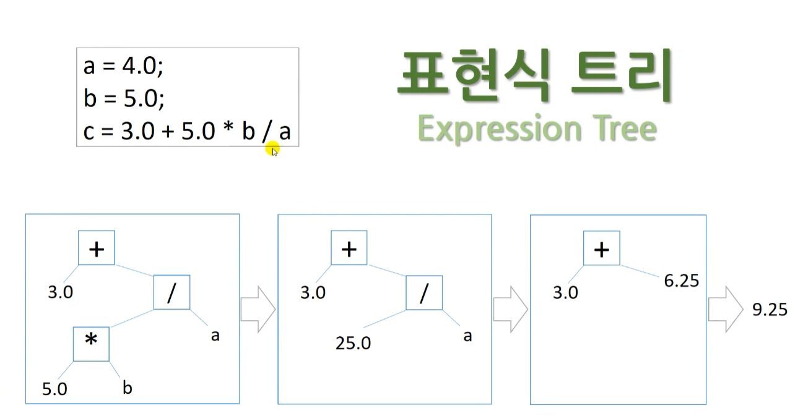
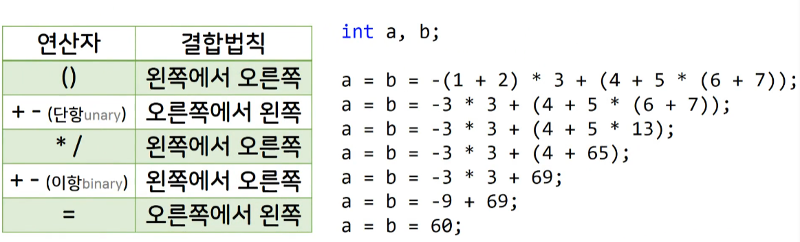
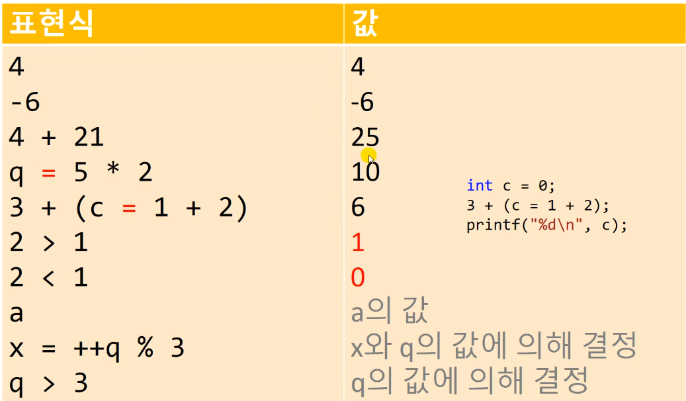
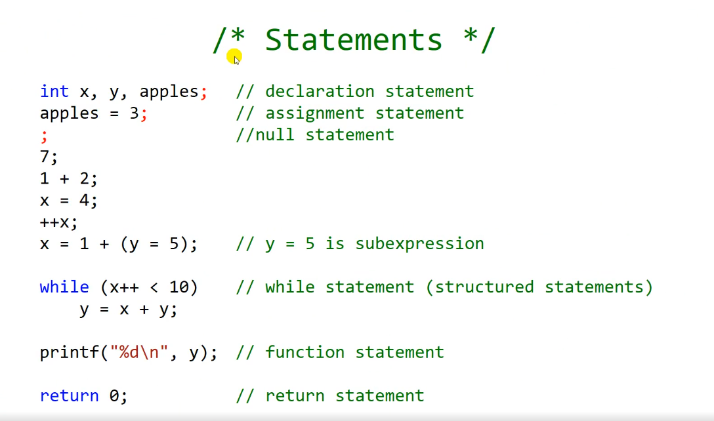
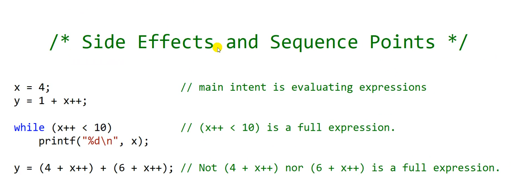
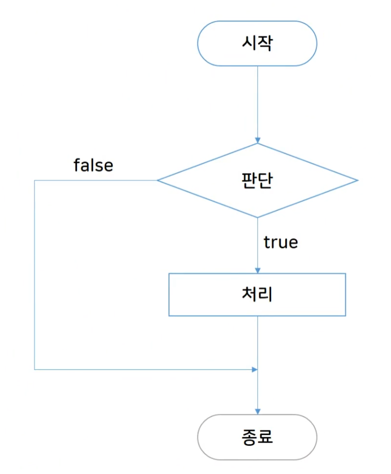
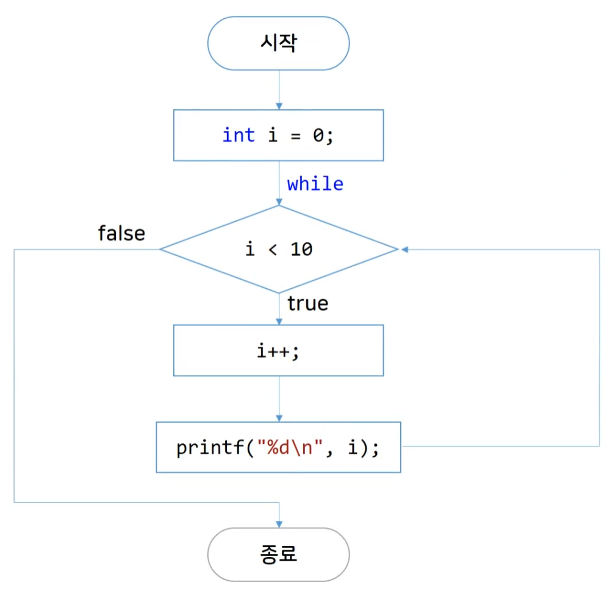

# 연산자, 표현식, 문장

## 반복 루프와의 첫만남

**LOOP**

- 사람이 지루해하는 반복 작업을 해보기

### 1부터 100까지 출력하기

- 하나하나 다 작성한다면

```c
#include <stdio.h>

int main()
{
	printf("1\n");
	printf("2\n");
	printf("3\n");
...
	printf("99\n");
	printf("100\n");
}
```

- 반복문이 있기 전에 사용한 `goto`문
  - `goto`문은 이제 쓰지 않는 단종되가는 코드.

```c
#include <stdio.h>

int main()
{
	int n = 1;

label:
	printf("%d\n", n);
	n = n + 1;

	if (n == 101) goto out;

	goto label;

out:

	return 0;
}
```

- `while` 문
  - 초기값, 탈출조건, 초기값의 변화

```c
#include <stdio.h>

int main()
{
	int n = 1;

	while (n < 101)
	{
		printf("%d\n", n);
		n = n + 1;
	}

	return 0;
}
```

## 대입 연산자와 몇 가지 용어

- Object, L-value, R-value, 피연산자

### 기본 연산자

- =, +, -, \*, /

### 연산자(operator)와 피연산자(operand)

```c
int i;
i = 1024;
i = i + 1;
```

1. = 은 같다가 아니라 i에 1024를 넣는다!
2. i + 1로 1025를 만들고 i에 1025를 넣는다!

### Data object, L-value, R-value

- Data Object : object
  - 데이터가 메모리 안에 존재하고 있을 때, 그 것이 오브젝트
- L-value : object locator value
  - 등호 기준 왼쪽, 대입을 받는, 메모리 주소가 존재하는.
  - 메모리를 차지하고 있는 특정 데이터 객체 (개체)
- R-value : value of an exprssion
  - 등호 기준 오른쪽, 대입을 해주는.
  - 수정 가능한 L-value에 대입될 수는 있지만 자기 자신은 L-value가 될 수 없는 것들

## 더하기, 빼기, 부호 연산자

**Addition, Sutraction, Sign**

```c
int income, salary, bonus;
income = salary = bonus = 100; // triple assignment;
```

- bonus에 100을 넣고, salary에 bonus(100)을 넣고 income에 salary(bonus, 100)을 넣는다.

```c
int main()
{
	int a, b, c;
	a = -7;
	b = -a; // b = 7
	c = +a; // c = -7

	1.0f + 2; // ? float로 리턴됨
	return 0;
}
```

### 연산 (operator)

- 이항 연산 (Binary operator) `3 - 2` : 피연산자 2개, 값이 1
- 단항 연산 (Unary operator) `-16` : 피연산자 1개, 값이 -16
- 복합 `-(12-11)` : 값이 -1

### 나누기 연산

- 정수 나눗셈을 하면 0에 가깝게 소숫점을 절삭한다
- 정수와 실수형을 나눗셈하면 실수로 결과를 만든다

```c
#define _CRT_SECURE_NO_WARNINGS
#include <stdio.h>

int main()
{
	printf("Integer divisions\n");
	printf("%d\n", 14 / 7);
	printf("%d\n", 7 / 2); // 3.5
	printf("%d\n", 7 / 3); // 2.333
	printf("%d\n", 7 / 4); // 1.75
	printf("%d\n", 8 / 4); // 2

	printf("\nTruncating toward zero (C99)\n");
	printf("%d\n", -7 / 2); // -3.5
	printf("%d\n", -7 / 3); // -2.333
	printf("%d\n", -7 / 4); // -1.75
	printf("%d\n", -8 / 4); // -2

	printf("\nInteger divisions\n");
	printf("%f\n", 9.0 / 4.0);
	printf("%f\n", 9.0 / 4);
	return 0;
}
```

**결과**

```c
Integer divisions
2
3
2
1
2

Truncating toward zero (C99)
-3
-2
-1
-2

Integer divisions
2.250000
2.250000
```

## 연산자 우선순위와 표현식 트리

### 표현식 트리 (Expression Tree)

{: width="300”}

### 연산자 우선순위

{: width="300”}

## 나머지 연산자

- `%`를 사용한다.

```c
int a = 13 % 5; // a = 3
int b = 90 % 60; // b = 30
```

- 전체 ‘초’를 가지고 시간, 분, 초로 나눠서 계산하기

```c
int main()
{
	int input_seconds = 0;
	int hours = 0, minutes = 0, seconds = 0;

	printf("Input seconds : ");
	scanf("%d", &input_seconds);
	seconds = input_seconds % 60;
	input_seconds /= 60;

	minutes = input_seconds % 60;
	input_seconds /= 60;

	hours = input_seconds % 60;
	input_seconds /= 60;
	printf("%d hours, %d minutes, %d seconds\n", hours, minutes, seconds);


	printf("Good bye~!\n");
	return 0;
}
```

### 음수 나누기

```c
int main()
{
	int div, mod;
	div = 11 / 5;
	mod = 11 % 5;
	printf("div : %d, mod : %d\n", div, mod);
	div = 11 / -5;
	mod = 11 % -5;
	printf("div : %d, mod : %d\n", div, mod);
	div = -11 / -5;
	mod = -11 % -5;
	printf("div : %d, mod : %d\n", div, mod);
	div = -11 / 5;
	mod = -11 % 5;
	printf("div : %d, mod : %d\n", div, mod);

	return 0;
}
>> div : 2, mod : 1
>> div : -2, mod : 1
>> div : 2, mod : -1
>> div : -2, mod : -1
```

- 나머지의 경우 피 연산자(앞의 수)가 양수면 양수, 음수면 음수가 된다.

## 증가 / 감소 연산자

- `++`, `--`
- 변수의 앞에 붙는다면 전위 연산자, 뒤에 붙는다면 후위 연산자라고 한다.

```c
#include <stdio.h>

int main()
{
    int a = 0;
    a++;
    printf("%d\n",a);// 1
    ++a;
    printf("%d\n",a);// 2
    printf("%d\n",a++);// 2가 출력되고 a는 3
    printf("%d\n",++a);// 4가 출력되고 a는 4
    return 0;
}
```

- 전위 연산자는 미리 ++ 연산이 끝난 이후에 나머지 일들이 일어나고 후위 연산은 반대

```c
#include <stdio.h>

int main()
{
    int i = 1, j = 1;
    int i_post, pre_j;

    i_post = i++;
    pre_j = ++j;

    printf("%d %d\n",i,j); // 2 2
    printf("%d %d\n",i_post,pre_j); // 1 2
    return 0;
}
```

- 꼬아놔도 무섭지 않음

```c
#include <stdio.h>

int main()
{
    int x, y, z;
    x = 3, y = 4;
    z = (x + y++);// 3+4연산을 하고 난 이후에 y = 5가 된다
printf("%d %d %d\n",x,y,z);
    return 0;
}
```

## 표현식과 문장

- Expressions 표현식. Statements 문장.

### 표현식 Expressions

{: width="300”}

- 대입의 경우 사이드이펙트(부가적인 효과)라고 본다.

### 문장 statements

{: width="300”}

### 부가효과 or 부차효과 Side effect

{: width="300”}

- 컴파일러는 `;` 세미콜론이 있어야 표현식을 읽어도 된다고 받아들인다.
- `++` 연산이 두 개 있는 경우는 어느 타이밍에 연산을 수행할 지 애매하게 된다. 이런 경우는 컴파일러마다 다른 값이 나올 수 있기 때문에 피해줘야한다.

## 순서도

Flowcharts

- 작성하는 프로그램의 흐름을 가시화할 때 사용

### 순서도의 형태

{: width="300”}

### 순서도 예시

```c
int i = 0;
    while (i < 10)
    // an example of compound statements (복합 문장)
    // (block)
    {
        i++;
        printf("%d\n",i);
    }
```

{: width="300”}

## 자료형 변환

**Type Conversions. 형변환**

### promotions in assignments

작은 규모의 자료형에서 큰 규모의 자료형으로는 문제가 생기지 않는다.

```c
short s = 64;
int i = s;

float f = 3.14f;
double d = f;
```

### demotion in assignments

컴파일시 워닝이 뜬다. (truncation, 절삭이 발생)

```c
float f;
double d;
d = 1.25;
f = 1.25;
f = 1.123; // truncation
```

### ranking of types in operations

1. long double > double > float
2. unsigned long long, long long
3. unsigned long, long
4. unsigned, int
5. short int, unsigned short int
6. signed char, char, unsigned char
7. \_Bool

```c
float f;
double d;
f = 1.25f;
d = f + 1.234; // double로 두 수를 변환해서 double끼리 더하는 연산을 하게 된다.
f = f + 1.234; // float + double은 double.
```
