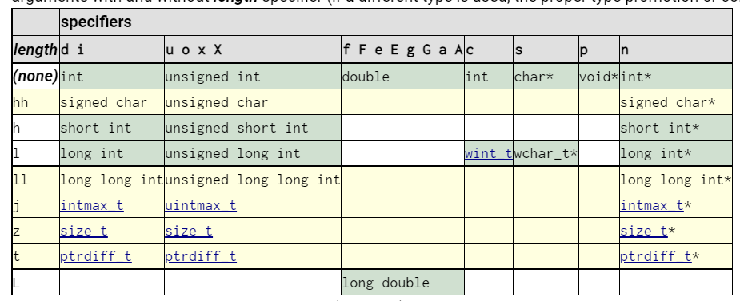
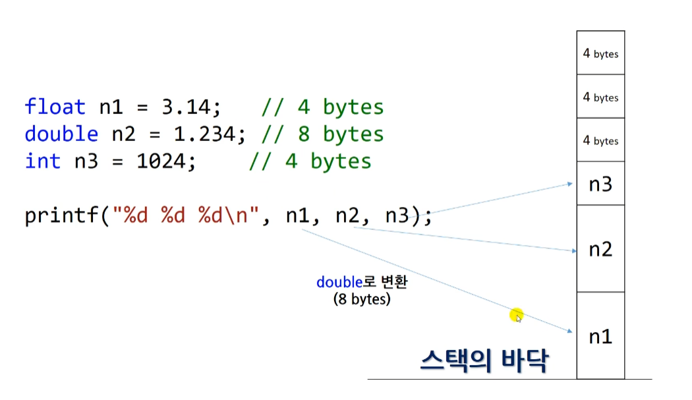
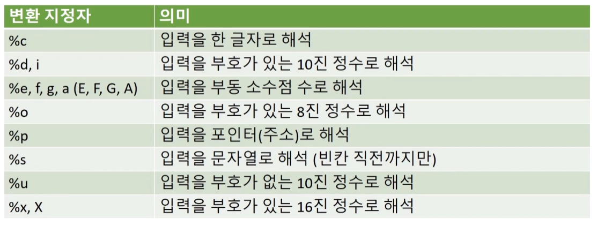
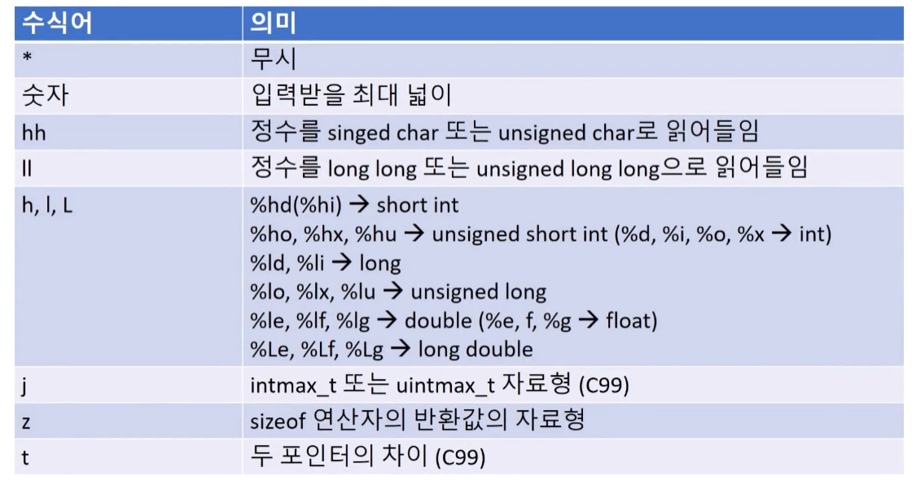

# 문자열과 형식 맞춘 입출력

## 문자열 입출력하기

- `char`로만 하면 문자를 하나만 입력할 수 있다!

```c
#include <stdio.h>

int main(void)
{
    char fruit_name; // stores only one character.

    printf("What is your favorite fruit?\n");

    scanf("%c", &fruit_name); // be careful with &

    printf("You like %c!\n", fruit_name);

    return 0;
}
```

- string을 만들어보기
  - 여기에서는 `scanf`에서 `&`을 쓰지 않는다. `fruit_name` 자체가 주소이기 때문!

```c
#include <stdio.h>

int main(void)
{
    char fruit_name[40]; // stores only one character.

    printf("What is your favorite fruit?\n");

    scanf("%s", fruit_name); // be careful with &

    printf("You like %s!\n", fruit_name);

    return 0;
}
```

## sizeof 연산자

### sizeof 사용법

```c
#include <stdio.h>
#include <stdlib.h> // malloc(
int main(void)
{
    /* 1. sizeof basic types */

    int a = 0;
    unsigned int int_size1 = sizeof a;    // 4
    unsigned int int_size2 = sizeof(int); // 4
    unsigned int int_size3 = sizeof(a);   // 4

    // size_t는 %zu로 형식 지정자를 사용한다.
    size_t int_size4 = sizeof(a);      // typedef unsigned long
    size_t float_size = sizeof(float); // typeof unsigned long

    printf("Size of int type is %u bytes.\n", int_size1);
    printf("Size of int type is %zu bytes.\n", int_size4);
    printf("Size of float type is %zu bytes.\n", float_size);
    // Size of int type is 4 bytes.
    // Size of int type is 4 bytes.
    // Size of float type is 4 bytes.

    return 0;
}
```

### 배열의 sizeof

```c
#include <stdio.h>
#include <stdlib.h> // malloc()

int main(void)
{
    /* 2. sizeof arrays */

    // 30개의 메모리 주소
    int int_arr[30]; // int_arr[0] = 1024; ...
    int *int_ptr = NULL;
    int_ptr = (int *)malloc(sizeof(int) * 30); // int_ptr[0] 1024; ...

    printf("Size of array = %zu bytes\n", sizeof(int_arr));
    printf("Size of pointer = %zu bytes\n", sizeof(int_ptr));
    // Size of array = 120 bytes
    // Size of pointer = 8 bytes

    return 0;
}
```

### 문자열과 sizeof + 구조체와 sizeof

```c
#include <stdio.h>
#include <stdlib.h> // malloc()

// 구조체
struct MyStruct
{
    int i;
    float f;
};

int main(void)
{
    /* 3. sizeof character array */

    char c = 'a';
    char string[10]; // maximally 9 charator + '/0' (null character)

    size_t char_size = sizeof(char);
    size_t str_size = sizeof(string);

    printf("Size of char type is %zu bytes.\n", char_size);
    printf("Size of string type is %zu bytes.\n", str_size);
    // Size of char type is 1 bytes.
    // Size of string type is 10 bytes.

    printf("%zu\n", sizeof(struct MyStruct));
    // 8 출력 : int 4bytes, float 4bytes
    return 0;
}
```

## 문자열이 메모리에 저장되는 구조

- 숫자 하나 : 1
- 숫자 배열 : 0 1 2 3 4 5 6 7 8 9
- 문자 하나 : ‘a’
- 문자 배열 : ‘H’ ‘e’ ‘l’ ‘l’ ‘o’ ‘\0’ ? ? ? ?

⇒ 문자열은 길이가 다 다를 수 있어서 마지막에 `NULL`을 넣어줘서 문자열의 끝을 알려준다.

### 배열을 만들고 접근하는 방법

- 인덱스는 0부터 접근하고 인덱스 범위를 넘어가면 에러 발생

```c
#include <stdio.h>

int main(void)
{
    int a = 1;
    int int_arr[10] = {0, 1, 2, 3, 4, 5, 6, 7, 8, 9};

    printf("%i %i %i\n", int_arr[0], int_arr[1], int_arr[2]);

    // printf("%i\n", int_arr[10000]);
    return 0;
}
```

### 문자열 선언, 출력

```c
#include <stdio.h>

int main(void)
{
    char c = 'a';
    char str1[10] = "Hello"; // null을 포함해서 6글자
    char str2[10] = {'H', 'i'};

    printf("%c\n", c);    // a
    printf("%s\n", str1); // Hello
    printf("%s\n", str2); // Hi

    // 10칸을 선언했는데 왜 출력이 안될까?
    // '\0'를 확인하면 프린트가 멈춘다!

    // "hi"를 확인하기!
    printf("%hhi %hhi %hhi %hhi %hhi\n", str2[0], str2[1], str2[2], str2[3], str2[4]);
}
```

### 문자열 특이한 케이스

```c
// 특이한 케이스
    char str3[10] = "Hello, World"; // array size is not enough
    char str4[20] = "Hello, \0World";
    printf("%s\n", str3);                  // "Hello, " 출력!
    printf("%c %c\n", str4[10], str4[11]); // r l 출력!
```

## strlen() 함수

- **문자열의 길이를 알려주는 함수**

```c
#include <stdio.h>
#include <string.h>

int main(void)
{
    char str1[100] = "Hello";
    char str2[] = "Hello"; // str2[6]으로 자동으로 맞춰줌.
    char str3[100] = "\0";
    char str4[100] = "\n";

    // sizeof vs strlen 비교
    printf("%zu %zu\n", sizeof(str1), strlen(str1)); // 100 5
    printf("%zu %zu\n", sizeof(str2), strlen(str2)); // 6 5
    printf("%zu %zu\n", sizeof(str3), strlen(str3)); // 100 0
    printf("%zu %zu\n", sizeof(str4), strlen(str4)); // 100 1
}
```

- **동적 할당**

```c
#include <stdio.h>
#include <stdlib.h>
#include <string.h>

int main(void)
{
    char *str5 = (char *)malloc(sizeof(char) * 100); // 메모리에 char 100칸 지정
    str5[0] = 'H';
    str5[1] = 'e';
    str5[2] = 'l';
    str5[3] = 'l';
    str5[4] = 'o';
    str5[5] = '\0';

    // sizeof(str5)는 char의 자체 사이즈가 나오게 된다
    printf("%zu %zu", sizeof(str5), strlen(str5)); // 8 5 출력!

    return 0;
}
```

## 기호적 상수와 전처리기

**Symbolic Constants & #define**

- 원주율 PI가 계속 사용되고 있는 ‘상수’인 경우

```c
#define _CRT_SECURE_NO_WARNINGS
#include <stdio.h>

int main()
{
	float radius, area, circum;
	printf("input radius : ");
	scanf("%f", &radius);

	area = 3.141592f * radius * radius;
	circum = 3.141592f * 2.0 * radius;

	printf("Area is %f\n", area);
	printf("Circumference is %f\n", circum);

	return 0;
}
```

→ `#define`으로 `3.141592f`을 `PI`로 정의해준다

```c
#define _CRT_SECURE_NO_WARNINGS
#include <stdio.h>
#define PI 3.141592f

int main()
{
	float radius, area, circum;
	printf("input radius : ");
	scanf("%f", &radius);

	area = PI * radius * radius;
	circum = PI * 2.0 * radius;

	printf("Area is %f\n", area);
	printf("Circumference is %f\n", circum);

	return 0;
}
```

### define

- 선언할 때 대문자, 스네이크 케이스로!
- 왜 `float PI = 3.141592f;` 로 안할까?
  - 꼭 define으로 해야하는 것은 아니다. 그러나 변수가 갑자기 바뀌게 되는 경우 혼란이 될 수 있기 때문이다.
  - 최근에는 `define`보다 `const float PI = 3.141592f;`로 선언을 더 권장한다.

### 명백한 상수

**Manifest Constants**

- 명단 상수라고도 교재들에 나오곤 하는 개념.
- Clear Or Obvious 느낌이라고 외국인들은 이야기한다.

## printf() 함수의 **변환 지정자들**

**Conversion Specifiers**

```c
printf(제어-문자열, 아이템1, 아이템2, ...)

// 예시
int a= 2;
printf("%d + %d = %d", 1, a, 1 + a);
```

### 형식 지정자

```c
%[flags][width][.precision][length]specifier

printf("%+10.5hi", 256);
>>    +00256
```

| 포멧문자                                   | 설명                          |
| ------------------------------------------ | ----------------------------- |
| %s                                         | ·       문자열 (String)       |
| ·       str() 내장 함수 사용               |
| %r                                         | ·       repr() 내장 함수 사용 |
| %c                                         | ·       문자 1개(character)   |
| ·       '%c' % 'k                          |
| %d                                         | ·       10진 정수 (Integer)   |
| ·       %5d: 5자리를 확보한 후 정수 포맷팅 |
| %i                                         | ·       %d와 동일             |

| %f
%F | ·       부동소수점 (floating-point) 실수
·       %5.2f: 소수점 포함 총 5자리 확보한 후 2자리는 소수점 이하 자리수 |
| %o
%O | ·       8진수
·       '%o' % 13 --> 15 |
| %x
%X | ·       16진수
·       '%x' % 13 --> 'd'
·       '%X' % 13 --> 'D' |
| %u | ·       부호 없는 정수. 음수는 양수처럼 해석함
·       '%u' % -12 --> '4294967284' |
| %e
%E | ·       부동 소수점 실수를 지수 형태로 표현
·       %.2e: 2자리는 소수점 이하 자리수 |
| %g
%G | ·       부동 소수점을 편의에 따라 일반 실수 형식이나 지수 형식으로 변환합니다.
·       즉, 값에 따라 %e 혹은 %f 으로 변환됩니다. |
| %% | ·       Literal % (문자 % 자체) |
| %p | ·       포인터 |

문자열 내에서 ‘보기에만 줄바꿈’하기

```c
int main()
{
	printf("I am... \
Iron MAN");
	return 0;
}

>> I am... Iron MAN 출력!
```

### 포맷팅하기

```c
int main()
{
	printf("%9d\n", 12345); // 9칸에 (스페이스바로) 채워서!
	printf("%09d\n", 12345); // 9칸인데, 0으로 채워서!
	printf("%.2f\n", 3.141592); // 소숫점 2자리
	printf("%.20f\n", 3.141592); // 소숫점 20자리
}

// 결과
    12345
000012345
3.14
3.14159200000000016217
```

## 변환 지정자의 수식어

**Modifiers**

### 형식 지정자

```c
%[flags][width][.precision][length]specifier

printf("%+10.5hi", 256);
>>    +00256
```

- `flags`, `width`, `.precision`, `length`를 **Modifiers**라 한다.
- `%+10.5hi`
  - `+` : 오른쪽에 붙혀서 출력
  - `10` : 10자리로 출력
  - `.5` : 정밀도를 나타내는 숫자 5개
  - `h` : 짧게
  - `i` : 정수

### flags

| flags   | description                                                                                                                                                                                                                                                                                                |
| ------- | ---------------------------------------------------------------------------------------------------------------------------------------------------------------------------------------------------------------------------------------------------------------------------------------------------------- |
| -       | Left-justify within the given field width; Right justification is the default (see width sub-specifier).                                                                                                                                                                                                   |
| +       | Forces to preceed the result with a plus or minus sign (+ or -) even for positive numbers. By default, only negative numbers are preceded with a - sign.                                                                                                                                                   |
| (space) | If no sign is going to be written, a blank space is inserted before the value.                                                                                                                                                                                                                             |
| #       | Used with o, x or X specifiers the value is preceeded with 0, 0x or 0X respectively for values different than zero.Used with a, A, e, E, f, F, g or G it forces the written output to contain a decimal point even if no more digits follow. By default, if no digits follow, no decimal point is written. |
| 0       | Left-pads the number with zeroes (0) instead of spaces when padding is specified (see width sub-specifier).                                                                                                                                                                                                |

### width

| width    | description                                                                                                                                                                                          |
| -------- | ---------------------------------------------------------------------------------------------------------------------------------------------------------------------------------------------------- |
| (number) | Minimum number of characters to be printed. If the value to be printed is shorter than this number, the result is padded with blank spaces. The value is not truncated even if the result is larger. |
| \*       | The width is not specified in the format string, but as an additional integer value argument preceding the argument that has to be formatted.                                                        |

### .precision

| .precision | description                                                                                                                                                                                                                                                                                                                                                                                                                                                                                                                                                                                                                                                                                                                                                                                          |
| ---------- | ---------------------------------------------------------------------------------------------------------------------------------------------------------------------------------------------------------------------------------------------------------------------------------------------------------------------------------------------------------------------------------------------------------------------------------------------------------------------------------------------------------------------------------------------------------------------------------------------------------------------------------------------------------------------------------------------------------------------------------------------------------------------------------------------------- |
| .number    | For integer specifiers (d, i, o, u, x, X): precision specifies the minimum number of digits to be written. If the value to be written is shorter than this number, the result is padded with leading zeros. The value is not truncated even if the result is longer. A precision of 0 means that no character is written for the value 0.For a, A, e, E, f and F specifiers: this is the number of digits to be printed after the decimal point (by default, this is 6).For g and G specifiers: This is the maximum number of significant digits to be printed.For s: this is the maximum number of characters to be printed. By default all characters are printed until the ending null character is encountered.If the period is specified without an explicit value for precision, 0 is assumed. |
| .\*        | The precision is not specified in the format string, but as an additional integer value argument preceding the argument that has to be formatted.                                                                                                                                                                                                                                                                                                                                                                                                                                                                                                                                                                                                                                                    |

### specifier

{: width="300”}

### 예시

```c
#define _CRT_SECURE_NO_WARNINGS
#include <stdio.h>
#include <limits.h>

int main()
{
	printf("%10i\n", 1234567);
	printf("%-10i\n", 1234567);
	printf("%+i \n%+i\n", 123, -123);
	printf("% i \n% i\n",123,-123);
	printf("%X\n", 17);
	printf("%#X\n", 17);
	printf("%05i\n", 123);
	printf("%*i\n", 7, 456);

	printf("\nPrecision\n");
	printf("%.3d\n", 1024);
	printf("%.5d\n", 1024);
	printf("%.3f\n", 123456.1234567);
	printf("%.3f\n", 123456.1235);

	printf("\nLength\n");
	printf("%hhd % hd %d\n", 257, 257, 257);
	printf("%d % ld %lld\n", INT_MAX + 1, INT_MAX, 2147483648LL);

	return 0;
}
```

**결과**

```c
   1234567
1234567
+123
-123
 123
-123
11
0X11
00123
    456

Precision
1024
01024
123456.123
123456.124

Length
1  257 257
-2147483648  2147483647 2147483648
```

## printf() 함수가 인자들을 해석하는 과정

{: width="300”}

- n1은 float이지만 printf에서는 부동소수점 수는 모두 double로 변환하기 때문에 8 bytes를 차지한다.

**코드**

```c
float n1 = 3.14; // 4bytes
double n2 = 1.234; // 8 bytes
int n3 = 1024; // 4bytes

printf("%f %f %d\n\n", n1, n2, n3);

printf("%d %d %d\n\n", n1, n2, n3); // 4, 4, 4 (N, N, N)
printf("%lld %lld %d\n\n", n1, n2, n3); // 8, 8, 4 (N, N, Y)
printf("%f %d %d\n\n", n1, n2, n3); // 8, 4, 4 (Y, N, N)
printf("%f %lld %d\n\n", n1, n2, n3); // 4, 4, 4 (Y, N, Y)
```

**결과**

```c
3.140000 1.234000 1024

1610612736 1074339512 -927712936

4614253070451212288 4608236261112822104 1024

3.140000 -927712936 1072938614

3.140000 4608236261112822104 1024
```

- int를 %d로 했는데도 2번째 printf에서 오류가 나온 이유
  - 수능볼 때 OMR카드 밀려쓴 것과 비슷한 이유 바이트가 밀려서 그렇다.

## scanf() 함수의 사용법

### 변환 지정자

{: width="300”}

### 수식어

{: width="300”}

### scanf 내부에서 일어나는 일

**빈칸으로 구분한다**

빈칸(스페이스바)를 만나면 그 앞에까지가 입력한 무언가로 받아들인다.

```c
int main()
{
	int i;
	float f;
	char str[30];
	scanf("%d %f %s", &i, &f, str); // 문자열은 &없이!
	printf("%d %f %s\n", i, f, str);
	return 0;
}

>> 123 3.14 hello hi! (입력!)
>> 123 3.140000 hello (출력!, hi!는 출력되지 않는다)
```

**문자**

```c
char c;
scanf("%c", &c);
printf("%i\n", c); // 아스키코드 출력
```

- 빈칸을 입력하면 아스키코드 32인 빈칸문자로 받아들인다.

**unsigned**

```c
int main()
{
	unsigned i;
	scanf("%i", &i); // try negative number
	printf("%i\n", i);

>> -123 입력시
>> -123 출력

	scanf("%u", &u); // unsigned는 unsigned 답게
	printf("%u\n", u);
>> -123 입력시
>> 4294967173
	return 0;
}
```

- 변수 선언을 unsigned로 했지만 scanf로 입력을 signed로 하는 경우 printf도 잘 나와버리는 상황이 나온다. → 그러나 헷깔리는 트릭은 안쓰는 것이 좋다.

**float, double**

```c
int main()
{
	// l for double for %f, %e, %E, %g
	double d = 0.0;
	scanf("%f", &d); // f
	printf("%f\n", d); // f
>> 3.14 입력
>> 0.000000 출력

	scanf("%lf", &d); // lf
	printf("%f\n", d); // f
>> 3.14 입력
>> 3.140000 출력
	return 0;
}
```

**width**

몇 글자까지만 입력 받을 것인지 제한 할 수 있다.

```c
int main()
{
	char str[30];
	scanf("%5s", str);
	printf("%s\n", str);

>> asdasdasd 입력
>> asdas 출력
	return 0;
}
```

### integer with characters

- int형에 문자까지 같이 입력하면 어떻게 될까?

```c
int main()
{
	int i;
	scanf("%i", &i);
	printf("%i", i);
	return 0;
}
>> 123a123 입력!
>> 123 출력!
```

- `printf`의 해석을 중단하고 숫자까지만 `i`에 넣어주게 된다.

### j modifier

- portable type이라는 차이점 외에는 똑같이 사용할 수 있다.

```c
#include <stdio.h>
#include <inttypes.h>

int main()
{
	intmax_t i; // longlong
	scanf("%ji", &i); // 1024
	printf("%ji", i); // 1024
	return 0;
}
```

### Regular characters

- `scanf`시에 의도한대로 %를 띄워주지 않으면 옳지 않은 결과가 나오게 된다.

```c
int main()
{
	int a, b;
	scanf("%d,%d",&a, &b);
	printf("%d %d\n", a, b);
	return 0;
}
>> 123,123 입력시 123 123 출력!
>> 123 123 입력시 123 858993460 출력!
>> 123 ,456 입력시 123 -858993460 출력!
>> 123(엔터) 입력시 123 -858993460 출력!
```

- 빈칸을 넣는다면?

```c
int main()
{
	int a, b;
	scanf("%d ,%d",&a, &b);
	printf("%d %d\n", a, b);
	return 0;
}
>> 123 ,123 입력시 123 123 출력!
>> 123       ,123 입력시 123 123 출력!
>> 123, 123 입력시 오류
```

- 콤마(,)만이 아니라 다른 기호, 문자도 똑같이 활용할 수 있다.

```c
int main()
{
	int a, b;
	scanf("%dA%d",&a, &b);
	printf("%d %d\n", a, b);
	return 0;
}
>> 123A123 입력시 123 123 출력!
```

- blank도 받을 수 있다.

```c
int main()
{
	int a, b;
	char c;
	scanf("%d%c%d",&a, &c, &b);
	printf("%d|%c|%d\n", a, c, b);
	return 0;
}
>> 123 456 입력시 123| |456 출력!
>> 123A456 입력시 123|A|456 출력!
```

### scanf의 return값

- 입력받은 값의 갯수를 의미한다.

```c
int main()
{
	int a, b;
	int i = scanf("%d%d",&a, &b);
	printf("%d\n", i);
	return 0;
}
>> 123 123 입력시 2 출력!
```

### modifier \* 를 통한 printf()

```c
int main()
{
	int i = 123;
	int width = 5;
	printf("Input width : ");
	scanf("%d", &width);
	printf("%*d\n", width, i);
	return 0;
}

<< 3 입력!
>> 123 출력!
<< 10 입력!
>>        123 출력! (공백이 7개 있는 총 10칸으로 출력!)
```

### modifier \* 를 통한 scanf()

- `*`이 있는 경우 무시가 된다. (빈칸, 줄바꿈으로 구분한다.)

```c
int main()
{
	int i;
	scanf("%*d%*d%d", &i);
	printf("Your third input %d\n", i);
	return 0;
}
<< 123(엔터)456(스페이스바)789 입력!
>> Your third input 789 출력!
```
