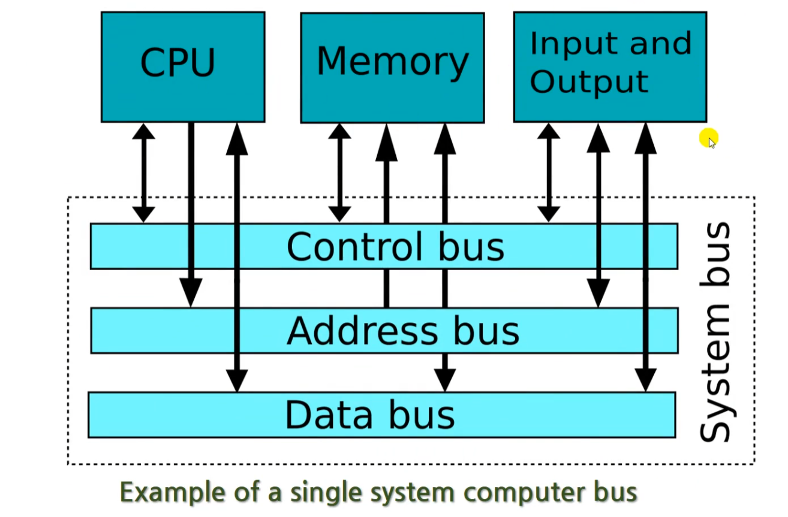

# 컴퓨터의 작동원리

## 컴퓨터의 작동원리 개요

- 하드웨어(hardware) & 소프트웨어(Software)
  - 이 둘의 관계는 육체와 정신의 관계라고 볼 수 있어서 어느 한 쪽이 더 중요하다고 할 수는 없다.

## 컴퓨터의 구성 요소

### 컴퓨터를 사용하는 순서

- 사용자(User) → 입력장치(Input device) → 컴퓨터 본체(Computer) → 출력 장치(Output device) → 사용자(User)
- 입력장치를 사용해서 입력한 내용을 바탕으로 ‘의도된’ 결과를 출력장치를 통해 받아낸다.

### 컴퓨터 본체에 들어가는 요소

- 전원 공급(Power)
- 냉각 장치
- 하드디스크, SSD 같은 보조기억 장치
- 그래픽 카드(GPU)
- 메인 보드(Mainboard)
- 중앙 처리장치(CPU)
- 주기억 장치(RAM)

### 중앙 처리장치(CPU)

- Central Processing Unit

### 주 기억장치 - 메모리

- Primary Storage - Computer Memory
- Random-Access Memory (RAM) : 임의 접근 메모리
- 전원을 끄면 데이터가 사라짐 (Volatile type of memory)
- 비교 : Read-Only Memory (ROM)

### 그래픽(스) 카드 (Graphics Card)

- GPU : Graphics Processing Unit
  - 그래픽카드 안에 있는 CPU
  - 메모리도 들어있다.
- 자체적으로 냉각 펜이 들어있곤 한다.

### 보조 기억장치 (Secondary Storage)

- HDD(Hard Disk Drive), SSD(Solid-State Drive)
- 컴퓨터를 꺼도 데이터가 보존되지만 주 기억장치보다 많이 느리다.

## 컴퓨터를 켤 때 일어나는 일 (부팅)

1. 전원 버튼 누르기 : 전원 공급장치가 컴퓨터 메인보드 안의 부품들에게 전기 공급
2. 부트 프로그램 실행 : 주로 메인보드 제조사의 로고가 뜨면서 부팅이 시작된다 (ROM BIOS 실행)
3. 하드웨어 검사 : 부트 프로그램이 하드웨어 검사
4. 운영 체제 로드 : HDD나 SSD에서 운영체제를 로드
5. 운영 체제 실행

## 운영체제가 해주는 일들

**Operating System (OS)**

- 컴퓨터를 킨다면 보조기억장치의 운영체제를 주기억장치에 옮기면 CPU가 사용하게 된다.
- 운영체제는 UNIX, Window,s, iOS, Linux, Mac OS 등등이 있다.

### 흐름

사용자 ↔ 시스템 프로그램, 응용 프로그램(System programs and application programs) ↔ 운영체제(OS) ↔ 커널(Kernel) ↔ 하드웨어 (CPU, 메모리, 보조기억장치, 입출력장치)

- 요즘에는 프로그램을 하나만 실행하지 않는다. 여러가지 프로그램이 작동하고 있다면 모두가 하드웨어를 쓰기 위해서 경쟁하게 된다. 이때 **하드웨어 자원을 관리**해주는 역할도 **OS**가 해준다

## 현대적 컴퓨터의 기본 구조

### 내장형 프로그램 방식의 컴퓨터 : 폰 노이만 구조

- Input Device → (Central Processing Unit(Control Unit, Artihmetic/Logic Unit) ↔ Memory Unit) → Output Device

### 폰 노이만 구조에서 업그레이드 된 현대

{: width="300”}

- bus : 2진수로 된 데이터를 운반해주는 역할
