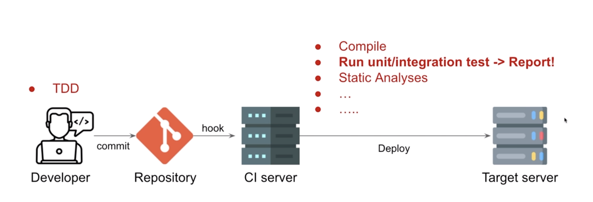
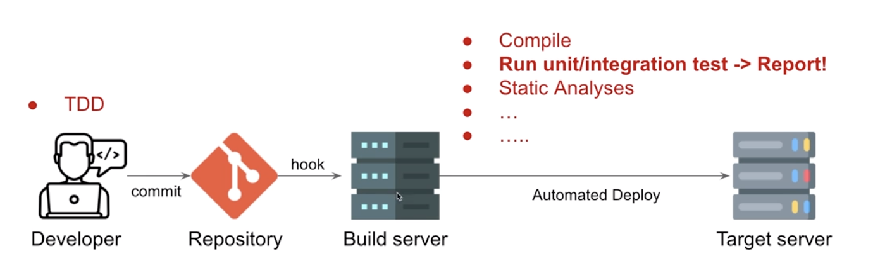
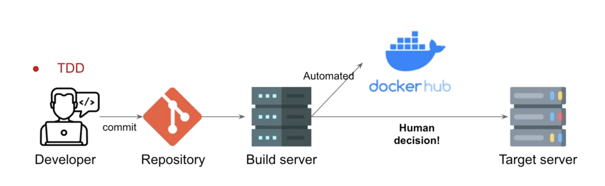

## CI/CD concept

- 고객의 니즈를 빠르게 해소하기 위해서 빠르게 배포하기 위해서, 시간을 단축시키는 전략

### 배포 방식의 변화

- **전통적인 배포 방식**
  → 배포 마감일을 정해서 열심히 작업하고 모여서 열심히 merge 이후 배포!
- **요즘의 배포 방식**
  1. 하나의 repository에 push/pull 을 하면서 합친다. 그 과정에서 나오는 충돌은 조금씩 여러 번 나오기 때문에 merge 지옥에서 벗어나기 쉽다.
  2. Bulid Server를 통해서 하루에도 몇 번씩 배포를 하게 된다.

### CI / CD : 자주 합치고 자주 배포하는 형태

- **CI** (지속적 통합)
- **CD** (지속적 전달 / 배포)

→ 이 과정을 통해 소프트웨어 배포 과정을 스피드업하게 해준다. 그리고 애자일 원칙에서 핵심적인 역할을 하게 된다.

## CI (Continuous Integration)

- 개발자들이 메인 라인에 자주 **merge**하는 행위
  → **merge (conflict) hell, integration hell**의 예방
- **Maintain a code repository**
  : 소스코드를 클론받았을 때 별도의 Dependency없이 buildable한 코드를 유지해야한다.
- **Automated the build & Keep the build fast**
  : 자동화된 빌드는 빠르고 유지되어야한다.
- **Everyone commits to the baseline every day & Every commit(to baseline) should be bulit**
  : 메인 레파지토리에 모든 사람들이 커밋을 하고 이 커밋을 하면 빌드가 되어야한다.
- **Every bug-fix commit should come with test case**
  : 버그 픽스 커밋일지라도 테스트 케이스를 거쳐야한다.
- **Test in a clone of the production environment (staging)**
  : 프로덕션 환경과 비슷한 환경에서 테스트를 해야한다.

### CI Workflows

- CI server에서 컴파일, 테스팅, 정적 분석 등을 다 거친 이후에 배포가 된다.

## CD (Continuous Deployment or Delivery)

- 소프트웨어 기능을 빠르고 자동화된 방식으로 배포하는 행위
- Continuous **Deployment**
  → ‘자동화’된 **배포.** 매 빌드마다 자동으로 배포하게 된다.
  
- Continuous **Delivery**
  → CI(build)로 배포가 완료된 상태를 유지하고 **배포 여부 결정하기**
  

### Deployment vs Delivery

- **Delivery > Deployment**
  - Deployment : IT적 측면
  - Delivery : 비즈니스적 측면이 추가됨
