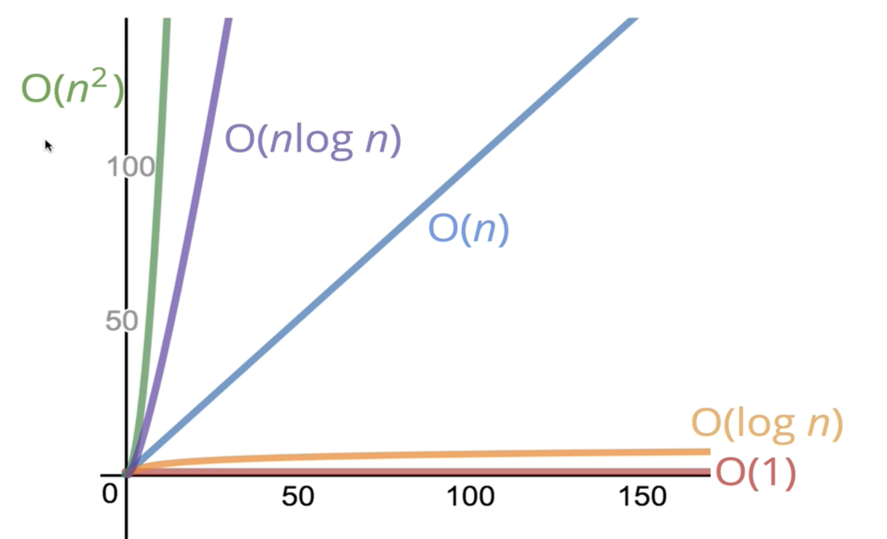

# Big O 표기법

## 목차

- [Big O의 필요성](#big-o의-필요성)
- [코드의 시간 재기](#코드의-시간-재기)
- [연산의 갯수 세기](#연산의-갯수-세기)
- [빅오에 대한 공식 소개](#빅오에-대한-공식-소개)
- [빅오 표기법 단순화하기](#빅오-표기법-단순화하기)
- [Big-O 시간 복잡도 퀴즈](#퀴즈-빅오-big-o-시간-복잡도-퀴즈)
- [공간 복잡도](#공간-복잡도)
- [Big-O 공간 복잡도 퀴즈](#퀴즈-2--빅오-공간-복잡도-퀴즈)
- [log 로그](#logarithms-로그)

## Big O의 필요성

- 그저 굴러가는 코드, 에러만 잡는 것이 아니라 더 시간이 걸리고 렉이 걸리는 코드의 이유를 알아야하기 때문이다.
- 어떤 방식으로도 문제를 해결할 수 있다. 그러나 그 중에서 어떤 것이 더 좋을 지(Best)를 고민하려면 판단 기준이 필요하다.
  → 코드를 **분류**하거나 **비교**할 수 있는 시스템이 있으면 얼마나 좋을까?
  : 코드의 성능을 얘기할 때 **정확한 용어**로 소통할 수 있어야한다.

## 코드의 시간 재기

**1에서 N까지 모든 정수를 더하는 함수를 만든다면?**

1. for문으로 1 + 2 + 3 … + N 더하기
2. N \* (N + 1) // 2 로 계산하기

→ 방식이 2가지인데, 그렇다면 어떤 함수가 더 나을까?

- **Faster**? (Let’s focus here first!)
- Less memory-intensive?
- More readable?

**시간을 확인해보자**

1번 함수

```jsx
function addUpTo(n) {
 let total = 0;
 for (let i = 1; i <= n; i++){
     total += i;
 }
 return total;
}

const t1 = performance.now();
addUpTo(1000000000);
const t2 = performance.now();
console.log(`Time Elapsed : ${(t2 - t1) / 1000} seconds`);

>> Time Elapsed : 0.9812999999998138 seconds
```

2번 함수

```jsx
function addUpTo(n) {
 return (n + 1)*n / 2
}

const t1 = performance.now();
addUpTo(1000000000);
const t2 = performance.now();
console.log(`Time Elapsed : ${(t2 - t1) / 1000} seconds`);

>> Time Elapsed : 0.00009999999962747097 seconds
```

💡 **The Problem with Time**

- 기기마다 다른 방식으로 시간을 기록하고 사양에 따라 시간이 달라질 수 있다.
- 기기가 같아도 다른 시간이 찍힐 수 있다.
- 빠른 알고리즘에는 너무 빠른 시간에 처리되다보니 시간을 기록하기 어렵다.

**→ 시간을 직접 측정하면 정확도가 떨어진다**

## 연산의 갯수 세기

코드가 실행될때 걸리는 정확한 시간을 초로 측정하는 것이 아니라 컴퓨터가 처리해야하는 **대략적인 연산 갯수, 추이**를 세기

**→ 컴퓨터의 연산 갯수는 사양이 달라져도 그대로**

```jsx
function addUpTo(n) {
 return n * (n + 1) / 2
}

-> 연산 횟수 : 곱하기, 더하기, 나누기 = 총 3회

function addUpTo(n) {
 let total = 0;
 for (let i = 1; i <= n; i++){
     total += i;
 }
 return total;
}

-> 연산  횟수 : 더하기+'=' 연산 n번 등등 = 5n + 2회
-> n의 값에 따라 비례하면서 증가
```

## 빅오에 대한 공식 소개

- **Big-O Notation is a way to formalize fuzzy counting** : 대략적으로 숫자를 세는 것
- **It allows us to talk formally about how the runtime of an algorithm grows as the inputs grow** : 정식으로 입력값이 늘어날수록 알고리즘의 실행시간이 어떻게 변하는 지 설명하는 공식
- **We won’t care about the details, only the trends** : 전반적인 추세에만 주목

### 빅오의 정의 (쉬운 버전)

- f(n) could be linear (f(n) = n)
- f(n) could be quadratic (f(n) = n\*\*2)
- f(n) could be constant (f(n) = 1)
- f(n) could be sometihing entirely different!

```jsx
function addUpTo(n) {
 return n * (n + 1) / 2
}

-> Big-O : O(1)

function addUpTo(n) {
 let total = 0;
 for (let i = 1; i <= n; i++){
     total += i;
 }
 return total;
}

-> Big-O : O(n)

function addUpTo(n) {
 let total = 0;
 for (let i = 1; i <= n; i++){
	for (let j = 1; j <= i; j++){
     total += 1;
	}
 }
 return total;
}

-> Big-O : O(n**2)

```

## 빅오 표기법 단순화하기

### Constants Don’t Matter 상수는 중요하지 않다

- O(2n) ⇒ O(n)
- O(500) ⇒ O(1)
- O(13n^2) ⇒ O(n^2)

### Smaller Terms Don’t Matter 작은 연산은 중요하지 않다

- O(n + 10) ⇒ O(n)
- O(1000n + 50) ⇒ O(n)
- O(n^2 + n + 8) ⇒ O(n^2)

### Big O Shorthands

1. **Arithmetic operations are constant**

   산수는 상수다.

2. **Variable assignment is constant**

   변수 배정도 상수다.

3. **Accessing elements in an array (by index) or object (by key) is constant**

   배열에서 몇 번째 아이템, 인덱스를 찾든, 해시맵에서 키로 값을 찾든 똑같은 상수 시간이 걸린다.

4. **In a loop, the complexity is the length of the loop times the complexity of whatever happens inside of the loop**

   루프가 있다면 복잡도는 루프의 길이를 곱한다.

## 퀴즈: 빅오 (BIG O) 시간 복잡도 퀴즈

질문 1:다음 빅오 표현식을 간단히 해보세요 - `O(n + 10)` 
**• `O(n)`** 
• `O(n^2)` 
• `O(n log n)`

질문 2:다음 빅오 표현식을 간단히 해보세요 - `O(100 * n)` 
• `O(2n)` 
• `O(1)`
**• `O(n)`**

질문 3:다음 빅오 표현식을 간단히 해보세요 - `O(25)` 
• `O(n)` 
• `O(n!)` 
**• `O(1)`**

질문 4:다음 빅오 표현식을 간단히 해보세요 -  `O(n^2 + n^3)` 
• `O(n^2)` 
• `O(n)` 
**• `O(n^3)`**

질문 5:다음 빅오 표현식을 간단히 해보세요 - `O(n + n + n + n)` 
• `O(4n)` 
**• `O(n)`** 
• `O(n^2)`

질문 6:아래 함수에 대한 시간 복잡도를 구하세요.

```jsx
function logUpTo(n) {
  for (var i = 1; i <= n; i++) {
    console.log(i);
  }
}
```

**• `O(n)`** 
• `O(n^2)` 
• `O(n log n)`

질문 7:아래 함수에 대한 시간 복잡도를 구하세요.

```jsx
function logAtMost10(n) {
  for (var i = 1; i <= Math.min(n, 10); i++) {
    console.log(i);
  }
}
```

**• `O(1)`** 
• `O(n)` 
• `O(n^2)`

질문 8:아래 함수에 대한 시간 복잡도를 구하세요.

```jsx
function logAtLeast10(n) {
  for (var i = 1; i <= Math.max(n, 10); i++) {
    console.log(i);
  }
}
```

**• `O(n)`** 
• `O(1)` 
• `O(n log n)`

질문 9:아래 함수에 대한 시간 복잡도를 구하세요.

---

```jsx
1. function onlyElementsAtEvenIndex(array) {
2.     var newArray = Array(Math.ceil(array.length / 2));
3.     for (var i = 0; i < array.length; i++) {
4.         if (i % 2 === 0) {
5.             newArray[i / 2] = array[i];
6.         }
7.     }
8.     return newArray;
9. }
```

**• `O(n)`**
• `O(1)`
• `O(n^2)`

질문 10:아래 함수에 대한 시간 복잡도를 구하세요.

```jsx
1. function subtotals(array) {
2.     var subtotalArray = Array(array.length);
3.     for (var i = 0; i < array.length; i++) {
4.         var subtotal = 0;
5.         for (var j = 0; j <= i; j++) {
6.             subtotal += array[j];
7.         }
8.         subtotalArray[i] = subtotal;
9.     }
10.     return subtotalArray;
11. }
```

• `O(1)` 
• `O(n)` 
**• `O(n^2)`**

## 공간 복잡도

- 알고리즘 자체가 필요로 하는 공간
- 입력이 커질수록 차지하는 공간(메모리)에 주목하는 방식

### 공간 복잡도 Rules in JS

- **Most primitives (booleans, numbers, undefined, null) are constant space**
  부울, 숫자, undefined, null은 자바스크립트에서는 모두 상수 공간
- **Strings require O(n) space (where n is the string length)**
  문자열은 문자열의 길이(n)만큼의 공간 O(n)이 필요하다.
- Reference types are generally O(n), where n is the length (for arrays) or the number of keys (for objects)
  참조타입도 주로 O(n). 객체의 키 갯수나 배열의 길이 n을 의미하게 된다.

### 공간 복잡도 예시

```jsx
function sum(arr) {
	let total = 0;
	for (let i = 0; i < arr.length; i++) {
		total += arr[i];
	}
}

-> O(n) : 배열의 길이만큼의 공간 복잡도를 갖는다.
				(나머지는 상수라서 취급하지 않는다.)
```

## 퀴즈 2 : 빅오 공간 복잡도 퀴즈

질문 1:아래 함수에 대한 공간 복잡도를 구하세요.

```jsx
1. function logUpTo(n) {
2.     for (var i = 1; i <= n; i++) {
3.         console.log(i);
4.     }
5. }
```

**• `O(1)`**
• `O(n)`
• `O(n log n)`

질문 2:아래 함수에 대한 공간 복잡도를 구하세요.

```jsx
1. function logAtMost10(n) {
2.     for (var i = 1; i <= Math.min(n, 10); i++) {
3.         console.log(i);
4.     }
5. }
```

**• `O(1)`** 
• `O(n)` 
• `O(n log n)`

질문 3:아래 함수에 대한 공간 복잡도를 구하세요.

```jsx
1. function onlyElementsAtEvenIndex(array) {
2.     var newArray = Array(Math.ceil(array.length / 2));
3.     for (var i = 0; i < array.length; i++) {
4.         if (i % 2 === 0) {
5.             newArray[i / 2] = array[i];
6.         }
7.     }
8.     return newArray;
9. }
```

**• `O(n)`**
• `O(n log n)`
• `O(n^2)`

질문 4:아래 함수에 대한 공간 복잡도를 구하세요.

```jsx
1. function subtotals(array) {
2.     var subtotalArray = Array(array.length);
3.     for (var i = 0; i < array.length; i++) {
4.         var subtotal = 0;
5.         for (var j = 0; j <= i; j++) {
6.             subtotal += array[j];
7.         }
8.         subtotalArray[i] = subtotal;
9.     }
10.     return subtotalArray;
11. }
```

• `O(1)`
**• `O(n)`**
• `O(n^2)`

---

## Logarithms (로그)

- O(1), O(n), O(n^2)처럼 빅오가 간단하지 않은 경우가 존재한다.
  따라서 빅오 표기에는 좀 더 어렵고나 덜 흔한 수학 개념들이 포함되어 있을 수 있다.
  그 중 자주 나오는 개념이 **로그**다.
- 그렇지만 밑이 2인지 e인지 등은 중요하지 않다. **‘추세’**만 본다. 그래도 보통 밑은 **2**로 고려한다.



- 시간 복잡도에 굉장히 좋다. 사실상 상수 복잡도와 비슷한 수준

### What’s a log again?

- 로그 함수? : 지수 함수의 역함수.
- 그럼 지수 함수는? : 로그 함수의 역함수.

### Example

- 8 → 4 → 2 → 1 == 25
  - log8 = 3
- 25 → 12.5 → 6.25 → 3.125 → …
  - 4 < log25 < 5
