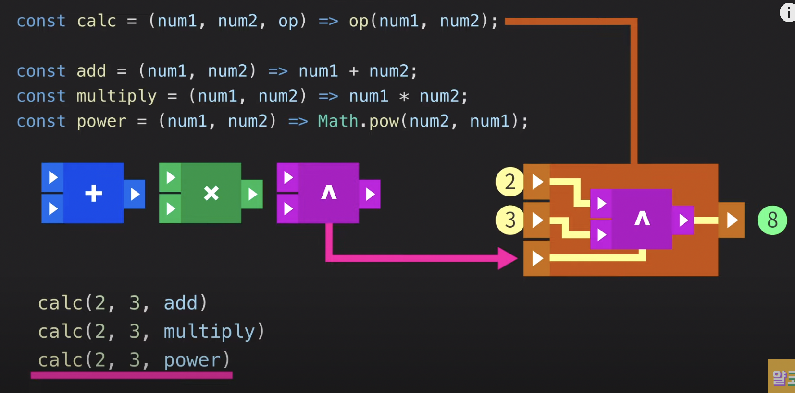
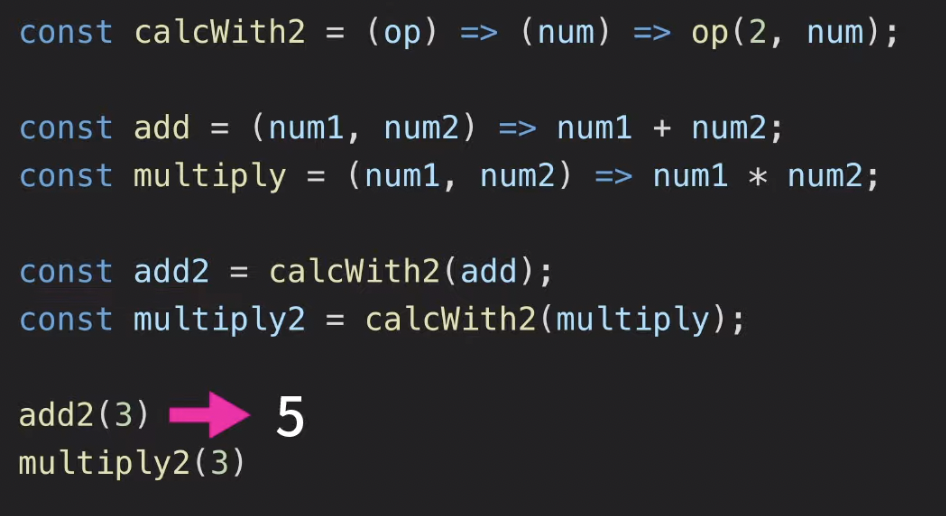
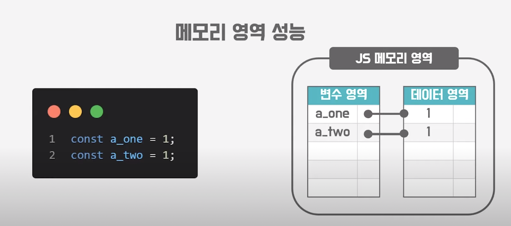

# 함수형 프로그래밍

**키워드** : 순수함수, 함수형 프로그래밍, 참조투명성, 불변성, 고차함수, 클로저

**객체** : 각 구성원들이 맡은 역할에 따라 하는 일을 하는 것

**함수형** : → → → 걍 함수 연결로 우당탕 ㄲ

- 인풋과 아웃풋이 존재해야함
- 외부환경으로부터 철저하게 독립적

> 객체에서 외부인이 **변수**를 건들면 매소드의 아웃풋은 바뀔 수 있지만 함수형은 아니다.

- 변수에 의한 부작용이 없다.
  - 이러한 부작용을 방지하기 위해 객체에서는 변수에 락을 걸거나 synchronized 등을 이용해 변수를 동기화한다. (수동적인 방식)

## 순수 함수

- 외부 요인으로부터 영향을 받지 않고, 같은 인풋에 같은 아웃풋을 만들어내는 함수

## 함수형 프로그래밍의 특징

1. 함수형 프로그래밍은 **선언형**이다.
   - 함수는 보통 인자를 처리하는 행위적인 개념으로만 사용한다.
   - 그렇지만 한 인풋에 같은 아웃풋을 만들어내는 함수의 연결?을 한다면, 변수처럼 생각할 수 있다?
2. 함수도 **변수**다.

   - 함수에 인자(인풋)만 넣어주면 변수로 결과가 나오기 때문

3. 고계함수 (고차함수)
   - 인자로 다른 함수를 받아 결과값을 내보내는 함수

{: width="300”}

{: width="300”}

## 불변성(Immutability)

- 자바스크립트에서 **원시타입**은 **불변**하고, **참조타입**은 **가변적**이다.

### 불변성 유지 방식의 장점

- 예측 가능성 (predictable)

  - 메모리 영역에서 데이터 영역은 불변이다. 만약 가변이라면?

  ```jsx
  // 아래와 같은 상황이 나타나게 된다.
  let a = 1;
  let b = a;

  a = 2;

  console.log(a); // 2
  console.log(b); // 2 <- 이거 곤란
  ```

- 성능 효율성 (efficiency)

  1. 메모리 영역 성능

     - 만약 같은 값이라도 데이터 영역의 다른 주소에 저장하게 되면 메모리 낭비를 겪게 된다.

     {: width="300”}

  2. 상태 변경 추적 성능

     {: width="300”}

## 참고 영상

**[10분 테코톡] 📏 인치의 불변성** : [https://www.youtube.com/watch?v=eV4Yzssr9MA](https://www.youtube.com/watch?v=eV4Yzssr9MA)

**함수형 프로그래밍이 뭔가요? :** [https://www.youtube.com/watch?v=jVG5jvOzu9Y](https://www.youtube.com/watch?v=jVG5jvOzu9Y)
