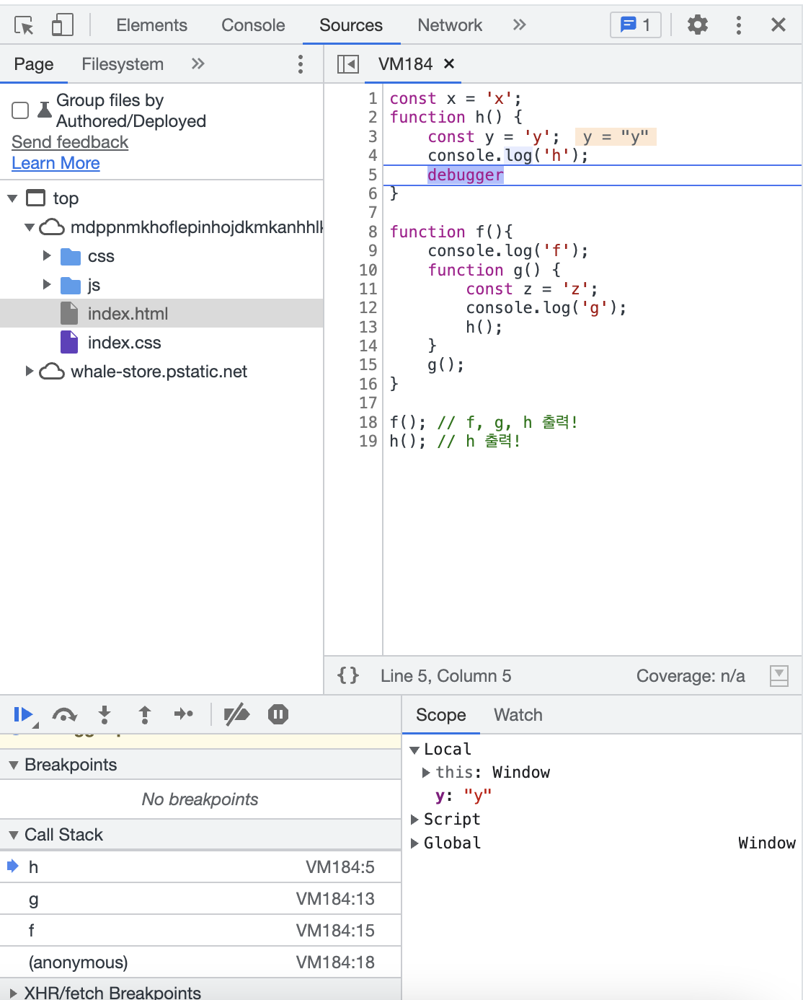

# JavaScript

## 목차

- [함수와 함수호출](#함수와-함수호출)
- [호출 스택](#호출-스택-call-stack)
- [스코프 체인](#스코프-체인)
- [호이스팅](#호이스팅)

---

## 함수와 함수호출

```jsx
// 화살표 함수 선언
const add = (a, b) => a + b;

// 화살표 함수로 객체를 리턴하고 싶다면?
const objReturn = (a, b) => ({a + b});
// 이러면 안됨 : const objReturn = (a, b) => {a + b};

add(3, 5); // 8이 return됨!
```

- **함수의 선언** : 함수 만들기
- **함수** : 함수 그 자체
- **함수의 호출** : 함수를 실행 (사용할 때는 `return 값`으로 대체해서 생각)

```jsx
const add = (a, b) => a + b;

function calculator(func, a, b) {
  return func(a, b);
}

calculator(add, 3, 5); // 8이 return됨!
// 이러면 안됨 calculator(add(), 3, 5);
```

- `add`는 **함수**, `add()`는 **함수의 호출 (값)**을 의미한다.

### **Example**

`addEventListener`에서 넣는 **함수**

```jsx
const add = (a, b) => a + b;

document.querySelector("#header").addEventListener("click", add); // add()를 넣지 않는다.
```

### 고차함수 : 괄호는 죄가 없음

```jsx
const onClick = () => () => {
  console.log("hi!");
};

document.querySelector("#header").addEventListener("click", onClick());
```

- `onClick`의 화살표 함수가 읽기 어렵다면?
  → `return 문`으로 바꿔주자

```jsx
const onClick = () => () => {
  console.log("hi!");
};

// 위 함수는 아래와 같다.

const onClick = () => {
  return () => {
    console.log("hi!");
  };
};

// 따라서

document.querySelector("#header").addEventListener("click", onClick());

// 위 문장은 아래와 같다.

document.querySelector("#header").addEventListener("click", () => {
  console.log("hi!");
});
```

---

## 호출 스택 (Call Stack)

```jsx
const x = "x";
function h() {
  const y = "y";
  console.log("h");
}

function f() {
  console.log("f");
  function g() {
    const z = "z";
    console.log("g");
    h();
  }
  g();
}

f(); // f, g, h 출력!
h(); // h 출력!
```

막 엄청 꼬여있는 코드들을 보고 정확하게 어떻게 변수를 가져올 수 있는 지 확인할 수 있어야한다.

→ 그치만 **자바스크립트 스펙 공식문서를 외우면 안된다.**

- 코드는 위에서 아래로 읽힌다. (1차원적)
  → 1차원적인 흐름을 벗어나야한다.
- 위 함수를 호출스택으로 그려보기

```jsx
>> f()  f 실행
>> f() console.log('f')  콘솔로그가 실행될 것임
>> f()  콘솔 끝 사라짐
>> f() g()   g 실행
>> f() g() console.log('g')   콘솔로그 실행
>> f() g() 콘솔 끝 사라짐
>> f() g() h()   h 실행
>> f() g() h() console.log('h')   콘솔로그 실행
>> f() g() h()   콘솔 끝 사라짐
>> f() g()   h 종료
>> f()   g 종료
>>    f 종료
>> h()   h 실행
>> h() console.log('h')   콘솔로그 실행
>> h()   콘솔 끝 사라짐
>>   h 종료
```

### debugger 사용

위 상황을 확실히 보려면 `debugger`를 사용하면 된다.

`h()`의 마지막에 `debugger`를 얹고 개발자도구에서 실행하면 Sources 창으로 옮겨가면서 호출 스택 (Call Stack)을 확인할 수 있다.



```jsx
// 시점은?
>> f() g() h()   콘솔 끝 사라짐
```

---

## 스코프 체인

: 함수에서 어떤 값에 접근 가능하고 접근 불가능한가?

- `function`, `if`, `while`같은 구문에 들어가는 `{ }` 블록이 기준이 된다.
- 블록 내에 있어야 접근 가능하다. 호출스택은 호출에 관련됐다면 스코프체인은 선언과 관련돼있다.

```jsx
const x = "x";
function h() {
  const y = "y";
  console.log("h");
}

function f() {
  console.log("f");
  function g() {
    const z = "z";
    console.log("g");
    h();
  }
  g();
}

f(); // f, g, h 출력!
h(); // h 출력!
```

h ← anonymous(전체)

f ← anonymous(전체)

g ← f ← anonymous

- f 함수에 y 변수를 사용할 수 없다.

**사슬처럼 줄줄이 엮여있어서 스코프 체인이라고 한다.**

체인을 트리로 보면 이렇다.

```jsx
anonymous
├─ x
│
├─ h
│  └─ y
│
└─ f
   └─ g
	    └─ z
```

### 똑같은 변수를 선언하기

- x 변수를 같은 위계에 만들면 에러가 된다.

```jsx
const x = "x";
const x = "y"; // 여기땜에 에러
function h() {
  const y = "y";
  console.log("h");
}

function f() {
  console.log("f");
  function g() {
    const z = "z";
    console.log("g");
    h();
  }
  g();
}

f(); // f, g, h 출력!
h(); // h 출력!
```

- 다른 스코프에 있다면 선언이 가능하다. (y 변수 만들기)

```jsx
const x = "x";

function h() {
  const y = "y"; // y 하나!
  console.log("h");
}

function f() {
  const y = "yy"; // y 하나 더!
  console.log("f");
  function g() {
    const z = "z";
    console.log("g");
    h();
  }
  g();
}

f(); // f, g, h 출력!
h(); // h 출력!
```

- 만약 겹치는 변수가 있다면 어떤 변수를 사용하게 될까?

```jsx
const x = "x";
function f() {
  // console.log(x); 오류가 나오는 부분!
  const x = "x2";
  console.log(x);
}
f(); // x2 출력
```

## 호이스팅

- **선언 전에 호출**을 한다면?
  → 이런 상황은 안만드는 것이 코드를 잘 짜는 것
- 어쩌다보니 쓰여지는 경우
  → `eslint`를 사용하기 (호이스팅 쓰지 않기 같은 룰을 적용해놓으면 코드검사에 뜬다)

### TDZ (Temporal Dead Zone)

- 이 상황은 피해줘야한다!

```jsx
const x = "x";
function f() {
  console.log(x);
  const x = "x2";
}
f(); // TDZ 템퍼럴 데드존 코드
```

- `const`, `let` 변수선언보다 위에서 변수에 접근하면 ‘일시적인 사각지대’에 걸리게 된다.

**호출과 선언은 상관 없음**

```jsx
function a() {
  console.log(z);
}
// a(); 불가능!!!
const z = "z1";
a(); // z1 출력
```

- 선언은 TDZ가 적용되지만 내용물은 상관쓰지 않는다.

### 남이 호이스팅을 만들어버린 경우

- `var`로 변수선언을 사용한 경우

```jsx
var y;

var y = "hi!"; // 여러번 선언 가능
// window.y == 'hi!' 로 등록되버림
```

- const, let을 쓰는 이유 : var는 코드가 꼬였을 때 헷갈리게 만든다. 직관적이지 않은 부분이 존재한다.
