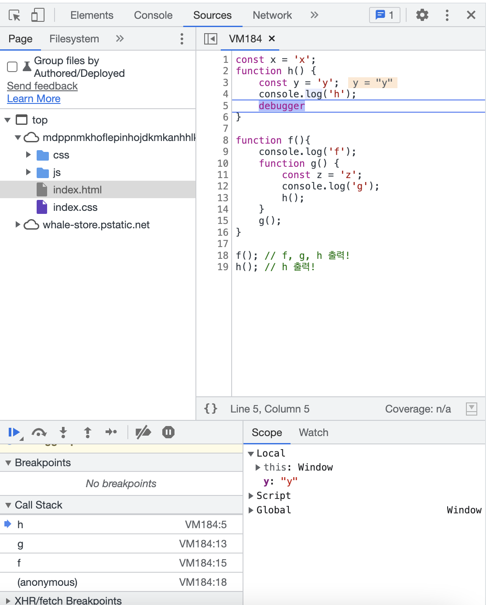

# JavaScript

## 목차

- [함수와 함수호출](#함수와-함수호출)
- [호출 스택](#호출-스택-call-stack)
- [스코프 체인](#스코프-체인)
- [호이스팅](#호이스팅)
- [this는 호출될 때 결정된다](#this는-호출-때-결정된다)
- [this를 분석할 수 없는 케이스](#this를-분석할-수-없는-케이스)
- [프로미스의 최고 장점](#프로미스의-최고-장점)

---

## 함수와 함수호출

```jsx
// 화살표 함수 선언
const add = (a, b) => a + b;

// 화살표 함수로 객체를 리턴하고 싶다면?
const objReturn = (a, b) => ({a + b});
// 이러면 안됨 : const objReturn = (a, b) => {a + b};

add(3, 5); // 8이 return됨!
```

- **함수의 선언** : 함수 만들기
- **함수** : 함수 그 자체
- **함수의 호출** : 함수를 실행 (사용할 때는 `return 값`으로 대체해서 생각)

```jsx
const add = (a, b) => a + b;

function calculator(func, a, b) {
  return func(a, b);
}

calculator(add, 3, 5); // 8이 return됨!
// 이러면 안됨 calculator(add(), 3, 5);
```

- `add`는 **함수**, `add()`는 **함수의 호출 (값)**을 의미한다.

### **Example**

`addEventListener`에서 넣는 **함수**

```jsx
const add = (a, b) => a + b;

document.querySelector("#header").addEventListener("click", add); // add()를 넣지 않는다.
```

### 고차함수 : 괄호는 죄가 없음

```jsx
const onClick = () => () => {
  console.log("hi!");
};

document.querySelector("#header").addEventListener("click", onClick());
```

- `onClick`의 화살표 함수가 읽기 어렵다면?
  → `return 문`으로 바꿔주자

```jsx
const onClick = () => () => {
  console.log("hi!");
};

// 위 함수는 아래와 같다.

const onClick = () => {
  return () => {
    console.log("hi!");
  };
};

// 따라서

document.querySelector("#header").addEventListener("click", onClick());

// 위 문장은 아래와 같다.

document.querySelector("#header").addEventListener("click", () => {
  console.log("hi!");
});
```

---

## 호출 스택 (Call Stack)

```jsx
const x = "x";
function h() {
  const y = "y";
  console.log("h");
}

function f() {
  console.log("f");
  function g() {
    const z = "z";
    console.log("g");
    h();
  }
  g();
}

f(); // f, g, h 출력!
h(); // h 출력!
```

막 엄청 꼬여있는 코드들을 보고 정확하게 어떻게 변수를 가져올 수 있는 지 확인할 수 있어야한다.

→ 그치만 **자바스크립트 스펙 공식문서를 외우면 안된다.**

- 코드는 위에서 아래로 읽힌다. (1차원적)
  → 1차원적인 흐름을 벗어나야한다.
- 위 함수를 호출스택으로 그려보기

```jsx
>> f()  f 실행
>> f() console.log('f')  콘솔로그가 실행될 것임
>> f()  콘솔 끝 사라짐
>> f() g()   g 실행
>> f() g() console.log('g')   콘솔로그 실행
>> f() g() 콘솔 끝 사라짐
>> f() g() h()   h 실행
>> f() g() h() console.log('h')   콘솔로그 실행
>> f() g() h()   콘솔 끝 사라짐
>> f() g()   h 종료
>> f()   g 종료
>>    f 종료
>> h()   h 실행
>> h() console.log('h')   콘솔로그 실행
>> h()   콘솔 끝 사라짐
>>   h 종료
```

### debugger 사용

위 상황을 확실히 보려면 `debugger`를 사용하면 된다.

`h()`의 마지막에 `debugger`를 얹고 개발자도구에서 실행하면 Sources 창으로 옮겨가면서 호출 스택 (Call Stack)을 확인할 수 있다.



```jsx
// 시점은?
>> f() g() h()   콘솔 끝 사라짐
```

---

## 스코프 체인

: 함수에서 어떤 값에 접근 가능하고 접근 불가능한가?

- `function`, `if`, `while`같은 구문에 들어가는 `{ }` 블록이 기준이 된다.
- 블록 내에 있어야 접근 가능하다. 호출스택은 호출에 관련됐다면 스코프체인은 선언과 관련돼있다.

```jsx
const x = "x";
function h() {
  const y = "y";
  console.log("h");
}

function f() {
  console.log("f");
  function g() {
    const z = "z";
    console.log("g");
    h();
  }
  g();
}

f(); // f, g, h 출력!
h(); // h 출력!
```

h ← anonymous(전체)

f ← anonymous(전체)

g ← f ← anonymous

- f 함수에 y 변수를 사용할 수 없다.

**사슬처럼 줄줄이 엮여있어서 스코프 체인이라고 한다.**

체인을 트리로 보면 이렇다.

```jsx
anonymous
├─ x
│
├─ h
│  └─ y
│
└─ f
   └─ g
	    └─ z
```

### 똑같은 변수를 선언하기

- x 변수를 같은 위계에 만들면 에러가 된다.

```jsx
const x = "x";
const x = "y"; // 여기땜에 에러
function h() {
  const y = "y";
  console.log("h");
}

function f() {
  console.log("f");
  function g() {
    const z = "z";
    console.log("g");
    h();
  }
  g();
}

f(); // f, g, h 출력!
h(); // h 출력!
```

- 다른 스코프에 있다면 선언이 가능하다. (y 변수 만들기)

```jsx
const x = "x";

function h() {
  const y = "y"; // y 하나!
  console.log("h");
}

function f() {
  const y = "yy"; // y 하나 더!
  console.log("f");
  function g() {
    const z = "z";
    console.log("g");
    h();
  }
  g();
}

f(); // f, g, h 출력!
h(); // h 출력!
```

- 만약 겹치는 변수가 있다면 어떤 변수를 사용하게 될까?

```jsx
const x = "x";
function f() {
  // console.log(x); 오류가 나오는 부분!
  const x = "x2";
  console.log(x);
}
f(); // x2 출력
```

---

## 호이스팅

- **선언 전에 호출**을 한다면?
  → 이런 상황은 안만드는 것이 코드를 잘 짜는 것
- 어쩌다보니 쓰여지는 경우
  → `eslint`를 사용하기 (호이스팅 쓰지 않기 같은 룰을 적용해놓으면 코드검사에 뜬다)

### TDZ (Temporal Dead Zone)

- 이 상황은 피해줘야한다!

```jsx
const x = "x";
function f() {
  console.log(x);
  const x = "x2";
}
f(); // TDZ 템퍼럴 데드존 코드
```

- `const`, `let` 변수선언보다 위에서 변수에 접근하면 ‘일시적인 사각지대’에 걸리게 된다.

**호출과 선언은 상관 없음**

```jsx
function a() {
  console.log(z);
}
// a(); 불가능!!!
const z = "z1";
a(); // z1 출력
```

- 선언은 TDZ가 적용되지만 내용물은 상관쓰지 않는다.

### 남이 호이스팅을 만들어버린 경우

- `var`로 변수선언을 사용한 경우

```jsx
var y;

var y = "hi!"; // 여러번 선언 가능
// window.y == 'hi!' 로 등록되버림
```

- const, let을 쓰는 이유 : var는 코드가 꼬였을 때 헷갈리게 만든다. 직관적이지 않은 부분이 존재한다.

---

## this는 호출 때 결정된다

→ 호출스택을 그릴 때 this값을 같이 그리면 된다.

- 콘솔에 `console.log(this)`를 입력하면 window 객체가 나온다.
  this는 기본적으로 window다. 노드에서는 global이라는 객체가 나온다. - 최근의 스택에서는 globalThis로 합쳐졌다.
- `‘use strict’` 로 strict 모드가 되면 this는 window가 아니라 undefined가 된다.

### this가 바뀌는 시점

```jsx
const obj = {
  name: "soul",
  sayName() {
    console.log(this.name);
  },
};

obj.sayName(); // soul 출력!
// window.name이 아닌 상황

const sayN = obj.sayName;
sayN(); // 아무것도 없는 것이 출력됨
```

- this는 함수가 호출될 때 정해진다.
- 호출할 때 함수 앞에 객체가 있다면 this가 해당 객체가 된다. : `obj.sayName()`
- 호출할 때 함수 앞에 객체가 없다면 this는 window : `sayN()`

### 화살표 함수를 쓰면 또 상황이 바뀜

- 화살표는 부모의 this

```jsx
const obj = {
  name: "soul",
  sayName: () => {
    console.log(this.name);
  },
};
obj.sayName(); // window.name 출력 (없음)
```

### 객체 생성 (new)

```jsx
function Human(name) {
	this.name = name;
}

new Human('soul');
>> Human {name: 'soul'}
// this는 이 타이밍에 객체 자신이 됨
```

### bind, call, apply

```jsx
function sayName() {
  console.log(this.name);
}

// 새로운 함수를 만들기
sayName.bind({ name: "soul" });

// 새로운 함수를 호출
sayName.call({ name: "soul" });

// 새로운 함수로 만들어서 호출
sayName.apply({ name: "soul" });
```

### 화살표 함수

- 화살표함수 안의 this는 부모함수의 this를 가져온다.

```jsx
const obj = {
  name: "soul",
  sayName: () => {
    console.log(this.name);
    function inner() {
      console.log(this.name);
    }
    inner();
  },
};

obj.sayName(); // window.name
// inner : window.name이 호출됨
```

```jsx
const obj = {
	name : 'soul',
	sayName() {
		console.log(this.name);
		function inner = () => {
			console.log(this.name);
		}
		inner();
	}
}

obj.sayName();
// soul 이 2번 출력
```

---

## this를 분석할 수 없는 케이스

```jsx
const header = document.querySelector ...
header.addEventListener('click', function() {
	console.log(this);
});
// header를 클릭하면 this는 해당 태그로 출력된다.
```

- 결론적으로 이런 경우의 this는 호출한 부분이 안보여서 외워야만 한다.
- 경험적으로 addEventListener는 this가 해당 태그가 나오는데 이런 형태의 함수들이 모두 이처럼 this가 나오진 않는다.

### 위 코드를 화살표함수로 쓰면?

```jsx
const header = document.querySelector ...
header.addEventListener('click', () => {
	console.log(this);
});
// header를 클릭하면 this는 해당 window로 출력된다.
```

- 화살표 함수는 call, bind같은 것을 붙일 수 없고 그냥 실행된다. 그리고 화살표 함수는 부모의 this를 따라간다.

### 만약 우리가 addEventListener같은 함수를 만들어야 한다면?

```jsx
const header = {
  addEventListener(eventName, callback) {
    callback.call(header);
  },
};
```

### apply vs bind vs call

- 결론 : a.apply(window) === a.bind(window)() === a.call(window)

```jsx
function add(a, b) {
  return a + b;
}
add.apply(null, [3, 5]); // 8
add.call(null, 3, 5); // 8
```

---

## 프로미스의 최고 장점

### Promise

- 실행은 됐는데, 결과값을 **나중에** 쓸 수 있는 것

```jsx
const promise = new Promise((resolve, reject) => {
  // 내용
});

const a = promise.then(() => {
  // 결괏값 사용하기!
});

promise.catch((에러) => {});
```

⇒ `setTimeout`은 콜백이 강하게 얽혀있어서 강제가 되는데, `promise`는 실행결과를 담아뒀다가 사용하고 싶을 때(`then`) 결괏값을 사용한다.

- `promise`에 바로 then, catch를 이어서 써버릇하다보니 callback, setTimeout의 진화버전이라 생각 할 수 있지만 아니다.
- `then`, `catch`는 따로 쓸 수 있다.
- `async`, `await`을 쓴다고 `then`, `catch`, `finally`를 안쓰지 않는다!

### promise 예시

```jsx
// 먼저 axios로 모든 데이터들을 쫙 가져온다.
const p1 = axios.get('서버주소1')
const p2 = axios.get('서버주소2')
const p3 = axios.get('서버주소3')
const p4 = axios.get('서버주소4')
const p5 = axios.get('서버주소5')

// 딴 짓 하 기

// p2가 필요한 시점
p.then((data) => {화면그리기(data)});

// 한방에 받아보기
Promise
	.all([p1, p2, p3, p4, p5])
	.then((results)
					=> {사용하기(result)});
```

### Promise.all, allSettled

- `all`은 단점 하나라도 에러뜨면 catch로 가버린다.
  - `catch`는 `all`의 범위 뿐만 아니라 `then`의 에러까지의 범위를 커버한다.

```jsx
Promise
	.all([p1, p2, p3, p4, p5])
	.then((results)
					=> {사용하기(result)})
	.catch((error)=>{ ㅜㅜ });

Promise
	.allSettled([p1, p2, p3, p4, p5])
	.then((results)
					=> {사용하기(result)});
```

- `allSettled`의 경우 일부만 성공한 경우 알 수 있다. `result`에 성공, 실패 여부가 들어가게 된다!
