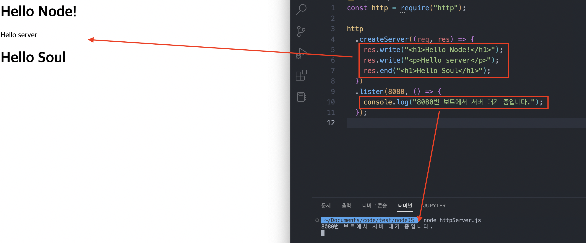

## 노드로 http 서버 만들기

### http 요청에 응답하는 노드 서버

- `createServer`로 요청 이벤트 대기
- `req` 객체는 요청에 관한 정보가, `res` 객체는 응답에 관한 정보가 담겨 있음

```jsx
const http = require("http");

http.createServer((req, res) => {
  // 여기에 어떻게 요청에 반응할 지가 들어감.
});
```



- 서버를 실행하면 `createServer`가 실행
- 실행하는 포트는 `listen`을 통해 `8080` 포트로 된다.

```jsx
const http = require("http");

const server = http
  .createServer((req, res) => {
    res.write("<h1>Hello Node!</h1>");
    res.write("<p>Hello server</p>");
    res.end("<h1>Hello Soul</h1>");
  })
  .listen(8080);

// listen의 콜백함수를 아래 on.~ listening으로 뺄 수 있다.

server.on("listening", () => {
  console.log("8080번 보트에서 서버 대기 중입니다.");
});

// 에러에 대한 이야기도 만들어낼 수 있다.

server.on("error", (error) => {
  console.error(error);
});
```
