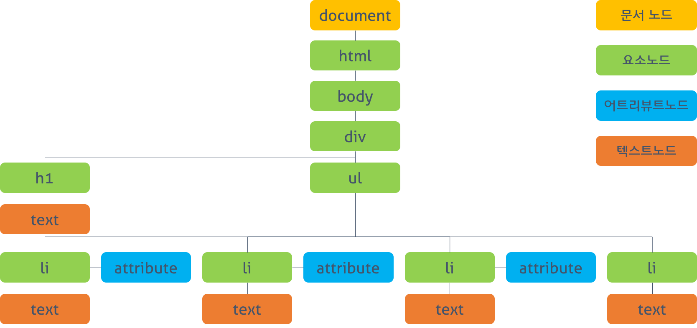

- 텍스트 파일로 만들어져있는 html을 브라우저에 렌더링하기 위해서는 웹 브라우저가 이해할 수 있는 구조로 메모리에 올려야한다.
  브라우저 렌더링 엔진은 웹 문서를 로드한 후, 파싱하여 웹 문서를 브라우저가 이해할 수 있는 구조로 구성하여 메모리에 적재하는데 이를 **DOM**이라 한다.
  - **DOM tree** : 엘리먼트의 어트리뷰트, 텍스트를 각각의 객체로 만들고 이들 객체를 부자 관계로 표현할 수 있는 트리구조

### DOM API를 활용한 동적 변경

- 동적 변경을 위해 프로그래밍 언어가 DOM에 접근하여 수정할 수 있는 방법이 있다. 일반적으로는 프로퍼티와 메소드를 갖는 자바스크립트 객체로 제공된다. 이를 **DOM API**라 한다.
- 정적 웹페이지에서 접근하여 동적으로 웹페이지를 변경하기 위한 유일한 방법은 메모리 상에 존재하는 DOM을 변경하는 것이고, 이때 필요한 것이 DOM에 접근하고 변경하는 프로퍼티와 메소드의 집합인 DOM API이다.

### DOM tree

- 브라우저가 HTML 문서를 로드, 파싱하여 생성한 모델을 의미. 객체 트리로 구조화돼있다.
- 예시

```
<!DOCTYPE html>
<html>
  <head>
    <style>
      .red  { color: #ff0000; }
      .blue { color: #0000ff; }
    </style>
  </head>
  <body>
    <div>
      <h1>Cities</h1>
      <ul>
        <li id="one" class="red">Seoul</li>
        <li id="two" class="red">London</li>
        <li id="three" class="red">Newyork</li>
        <li id="four">Tokyo</li>
      </ul>
    </div>
  </body>
</html>
```



DOM tree 예시

DOM에서 모든 요소, 어트리뷰트, 텍스트는 하나의 객체이며 Document 객체의 자식이다.

**Document Node (문서 노드)**

- 트리의 최상위. 어떤 노드를 접근하든 이 곳을 통해야하는 시작점 (entry point)

**Element Node (요소 노드)**

- HTML 요소를 표현한다. 부자관계를 통해 정보를 구조화한다. 어트리뷰트, 텍스트 노드에 접근하려면 먼저 해당 요소 노드를 찾아 접근해야한다.

**Attribute Node (어트리뷰트 노드)**

- HTML 요소의 어트리뷰트를 표현한다. 해당 노드를 찾아 접근하면 참조, 수정할 수 있다.

**Text Node (텍스트 노드)**

- HTML 요소의 텍스트를 표현한다. 자식요소(노드)를 가질 수 없다. DOM tree의 최종단.

### DOM 조작

- 순서
  1. 조작하고자 하는 요소를 선택, 탐색
  2. 선택된 요소의 콘텐츠 또는 어트리뷰트 조작
  - 자바스크립트는 이것에 필요한 API를 제공한다.

## XPath

XPath란 XML Path Language를 의미합니다.

XPath는 XML 문서의 특정 요소나 속성에 접근하기 위한 경로를 지정하는 언어입니다.

XPath는 W3C 표준 권고안으로, XSLT와 XPointer에 사용될 목적으로 만들어졌습니다.

또한, XML DOM에서 노드를 검색할 때에도 사용할 수 있습니다.

### 특징

1. XPath는 XML 문서를 탐색하기 위해 경로 표현식(path expression)을 사용합니다.
2. XPath는 수학, 문자열 처리 등을 하기 위한 표준 함수 라이브러리를 내장하고 있습니다.

3. XPath는 W3C의 표준 권고안인 XSLT에서 가장 중요한 부분 중 하나입니다.

### XPath 노드의 형식

XPath에서 사용하는 노드의 형식은 다음과 같이 구분됩니다.

1. 루트 노드
2. 요소 노드
3. 텍스트 노드
4. 속성 노드
5. 주석 노드
6. 네임스페이스(namespace) 노드
7. 처리 명령(processing instruction) 노드
